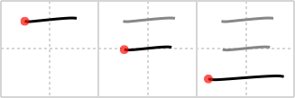

# {三}

## `three`

## Strokes: 3

## Reading:

### On-Yomi: サン、ゾウ &mdash; Kun-Yomi: み、み.つ、みっ.つ

### Examples: 三 (み), 三つ (み.つ), 三つ (みっ.つ)

## Words:

三味線(さみせん): three-stringed Japanese guitar, shamisen

三(み): (num) three

三日月(みかずき): new moon, crescent moon

再三(さいさん): again and again, repeatedly

三角(さんかく): triangle, triangular

三日月(みかづき): new moon, crescent moon

三日(みっか): three days, the third day (of the month)

三(さん): three

三つ(みっつ): three
