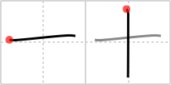

## `ten`

## [2]

## Reading:

### On-Yomi: ジュウ、ジッ、ジュッ &mdash; Kun-Yomi: とお、と

## Heisig story:

Turn this character 45 degrees either way and you have the x used for the Roman numeral <b>ten</b>.

## Premitive:

As a primitive, this character sometimes keeps its meaning of ten and sometimes signifies NEEDLE, this latter derived from the kanji for NEEDLE 針 (FRAME 274 針). Since the primitive is used in the kanji itself, there is no need to worry about confusing the two. In fact, we shall be following this procedure regularly. SIMPLE  You can use the Roman character for ten (rotated 45 degrees).

## Koohii stories:

1) [<a href="http://kanji.koohii.com/profile/Christine_Tham">Christine_Tham</a>] 24-7-2007(68): Two needles crossing marks the spot, or you can use the Roman character for<strong> ten</strong> (rotated 45 degrees).

2) [<a href="http://kanji.koohii.com/profile/naur_caraniril">naur_caraniril</a>] 11-10-2008(47): I scared away<strong> ten</strong> vampires with a single cross!

3) [<a href="http://kanji.koohii.com/profile/vgambit">vgambit</a>] 23-6-2007(23): <strong>Ten</strong> looks like a plus sign.

4) [<a href="http://kanji.koohii.com/profile/fernglas">fernglas</a>] 2-3-2009(21): A roman<strong> ten</strong> (X) standing on one leg.

5) [<a href="http://kanji.koohii.com/profile/Kaithegreat">Kaithegreat</a>] 31-7-2009(10): T for<strong> ten</strong>.

6) [<a href="http://kanji.koohii.com/profile/ruschein">ruschein</a>] 1-1-2009(9): Little t is for 10.

7) [<a href="http://kanji.koohii.com/profile/lbphenom">lbphenom</a>] 8-1-2008(6): Ask<strong> ten</strong> men what the cross means to them and you&#039;ll get<strong> ten</strong> different answers.

8) [<a href="http://kanji.koohii.com/profile/yukio86">yukio86</a>] 30-11-2012(4): I romani usavano una X per indicare il numero 10. Qui la x è semplicemente ruotata di 45º.

9) [<a href="http://kanji.koohii.com/profile/stratzvyda">stratzvyda</a>] 4-4-2012(4): I killed<strong> ten</strong> vampires with a single cross as small as a <em>needle</em>, damn I&#039;m good.

10) [<a href="http://kanji.koohii.com/profile/evalyne">evalyne</a>] 4-5-2010(4): Roman Numaral for<strong> ten</strong> X flipped on its side.
