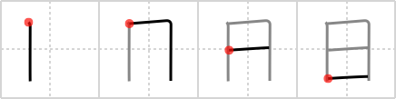

# {日}

## `day`

## Strokes: 4

## Reading:

### On-Yomi: ニチ、ジツ &mdash; Kun-Yomi: ひ、-び、-か

### Examples: 日時 (にちじ), 日光 (にっこう), 毎日 (まいにち), 日 (か), 日 (ひ)

## Words:

悪日(あくび): unlucky day

明後日(あさって): day after tomorrow

明日(あした): tomorrow

一日(いちじつ): one day, first of month

一昨日(おととい): day before yesterday

日付(かづけ): date, dating

月日(がっぴ): (the) date

期日(きじつ): fixed date, settlement date

今日は(こんにちは): hello, good day (daytime greeting id)

一昨昨日(さきおととい): two days before yesterday

明々後日(しあさって): two days after tomorrow

終日(しゅうじつ): all day

七日(なのか): seven days, the seventh day (of the month)

西日(にしび): westering sun

日夜(にちや): day and night, always

日当(にっとう): daily allowance

日頃(ひごろ): normally, habitually

日取り(ひどり): fixed date, appointed day

日向(ひなた): sunny place, in the sun

日の丸(ひのまる): the Japanese flag

日々(ひび): every day, daily, day after day

日焼け(ひやけ): sunburn

三日月(みかずき): new moon, crescent moon

連日(れんじつ): every day, prolonged

一昨日(いっさくじつ): day before yesterday

今日(こんにち): today

祭日(さいじつ): national holiday, festival day

祝日(しゅくじつ): national holiday

生年月日(せいねんがっぴ): birth date

先日(せんじつ): the other day, a few days ago

月日(つきひ): (the) date

定休日(ていきゅうび): regular holiday

当日(とうじつ): appointed day

日(にち): Japan-, Japanese-

日時(にちじ): date and time

日常(にちじょう): ordinary, regular, everyday, usual

日用品(にちようひん): daily necessities

日課(にっか): daily lesson, daily work, daily routine

日光(にっこう): sunlight

日中(にっちゅう): daytime, during the day, Sino-Japanese

日程(にってい): agenda

日当たり(ひあたり): exposure to the sun, sunny place

日帰り(ひがえり): day trip

日陰(ひかげ): shadow

日付(ひづけ): date

日日(ひにち): every day, daily, day after day

日の入り(ひのいり): sunset

日の出(ひので): sunrise

平日(へいじつ): weekday, ordinary days

三日月(みかづき): new moon, crescent moon

三日(みっか): three days, the third day (of the month)

明後日(みょうごにち): day after tomorrow

夕日(ゆうひ): setting sun

曜日(ようび): day of the week

来日(らいにち): arrival in Japan, coming to Japan, visit to Japan

明日(あす): tomorrow

日記(にっき): diary

日(ひ): day

一日(いちにち): first of month

五日(いつか): five days, the fifth day (of the month)

火曜日(かようび): Tuesday

金曜日(きんようび): Friday

昨日(きのう): yesterday

今日(きょう): today, this day

月曜日(げつようび): Monday

九日(ここのか): nine days, the ninth day (of the month)

水曜日(すいようび): Wednesday

誕生日(たんじょうび): birthday

一日(ついたち): first day of month

十日(とおか): ten days, the tenth day of the month

土曜日(どようび): Saturday

七日(なのか): seven days, the seventh day of the month

日曜日(にちようび): Sunday

二十日(はつか): twenty days, twentieth day of the month

二日(ふつか): second day of the month, two days

毎日(まいにち): every day

六日(むいか): six days, sixth (day of month)

木曜日(もくようび): Thursday

八日(ようか): eight days, the eighth (day of the month)

四日(よっか): fourth day of the month, four days
