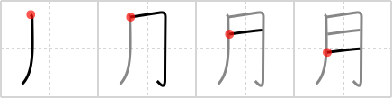

## {13}

## `month`

## [4]

## Reading:

### On-Yomi: ゲツ、ガツ &mdash; Kun-Yomi: つき

### Examples: 月曜 (げつよう), 明月 (めいげつ), 歳月 (さいげつ), 月 (つき)

## Words:

五月蝿い(うるさい): noisy, loud, fussy

ヶ月(かげつ): (number of) months

月日(がっぴ): (the) date

月謝(げっしゃ): monthly tuition fee

月賦(げっぷ): monthly installment

月曜(げつよう): Monday

月並み(つきなみ): every month, common

満月(まんげつ): full moon

三日月(みかずき): new moon, crescent moon

月給(げっきゅう): monthly salary

月末(げつまつ): end of the month

再来月(さらいげつ): month after next

生年月日(せいねんがっぴ): birth date

先々月(せんせんげつ): month before last

月(つき): month, moon

月日(つきひ): (the) date

年月(としつき): months and years

年月(ねんげつ): months and years

三日月(みかづき): new moon, crescent moon

さ来月(さらいげつ): the month after next

月曜日(げつようび): Monday

今月(こんげつ): this month

先月(せんげつ): last month

一月(ひとつき): one month

毎月(まいげつ): every month, each month, monthly

来月(らいげつ): next month
