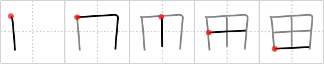

## `rice field`

## [5]

## Reading:

### On-Yomi: デン &mdash; Kun-Yomi: た

## Koohii stories:

1) [<a href="http://kanji.koohii.com/profile/Chisaku">Chisaku</a>] 30-6-2007(114): A<strong> rice field</strong> divided into four parts. 

2) [<a href="http://kanji.koohii.com/profile/Kosmo">Kosmo</a>] 17-5-2008(41): <em>Ten</em> people use their <em>mouths</em> to eat the yield of the <strong>rice fields</strong>. 

3) [<a href="http://kanji.koohii.com/profile/ruschein">ruschein</a>] 4-1-2009(30): <em>Ten</em><strong> rice field</strong>s can feed many <em>mouths</em>. 

4) [<a href="http://kanji.koohii.com/profile/chrisgaunt">chrisgaunt</a>] 3-1-2011(16): A farmer must use his <em>brain</em> to measure out a 4-plot <strong>rice field</strong>. 

5) [<a href="http://kanji.koohii.com/profile/mikan">mikan</a>] 16-12-2007(11): One day the farmer is neatly digging his<strong> rice field</strong> chopping down with his spade in two directions at 90 degrees, when suddenly there is a crunching sound as he has chopped twice into the skull of a dead body exposing the <strong>brain</strong>s sliced into four pieces. Ughhh ! 

6) [<a href="http://kanji.koohii.com/profile/Tsuki56">Tsuki56</a>] 6-6-2009(9): <strong>Rice field</strong>s are split in four sections--one for each season! 

7) [<a href="http://kanji.koohii.com/profile/rocky_923">rocky_923</a>] 30-10-2007(7): <strong>Rice field</strong>s feed many mouths. 

8) [<a href="http://kanji.koohii.com/profile/bexinkyushu">bexinkyushu</a>] 17-6-2010(6): A person&#039;s brains and a<strong> rice field</strong> are alike. If they are nourished, both will flourish. 

9) [<a href="http://kanji.koohii.com/profile/Aguila">Aguila</a>] 20-4-2012(4): I can see the<strong> rice field</strong> through my window. 

10) [<a href="http://kanji.koohii.com/profile/minkoko">minkoko</a>] 13-3-2010(4): A<strong> rice field</strong> can feed <em>10</em> <em>mouths</em>. 
