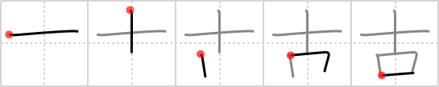

## {16}

## `old`

## [5]

## Reading:

### On-Yomi: コ &mdash; Kun-Yomi: ふる.い、ふる-、-ふる.す

### Examples: 古い (ふる.い), 古す (ふる.す)

## Words:

古(いにしえ): antiquity, ancient times

考古学(こうこがく): archaeology

古代(こだい): ancient times

稽古(けいこ): practice, training, study

古典(こてん): old book, classic, classics

中古(ちゅうこ): used, second-hand, old, Middle Ages

古い(ふるい): old (not person), aged, ancient, antiquated, stale, threadbare, outmoded, obsolete article
