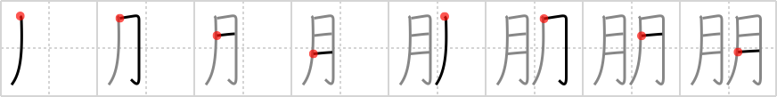

## `companion`

## [8]

## Reading:

### On-Yomi: ホウ &mdash; Kun-Yomi: とも

## Heisig V6:

The first <b>companion</b> that God made, as the Bible story goes, was Eve. Upon seeing her, Adam exclaimed, &quot;<i>Flesh</i> of my <i>flesh</i>!&quot; And that is precisely what this character says in so many strokes.

## Koohii stories:

1) [<a href="http://kanji.koohii.com/profile/Christine_Tham">Christine_Tham</a>] 21-7-2007(136): My<strong> companion</strong> and I are like two moons side by side.

2) [<a href="http://kanji.koohii.com/profile/kylemanning">kylemanning</a>] 22-11-2007(60): One moon is lonely. Two moons are<strong> companion</strong>s.

3) [<a href="http://kanji.koohii.com/profile/lucianreign">lucianreign</a>] 15-11-2006(47): Under the twin moons of Tatooine, Luke had no<strong> COMPANION</strong>.

4) [<a href="http://kanji.koohii.com/profile/xombijosh">xombijosh</a>] 10-3-2008(36): Two bodies next to each other;<strong> companion</strong>s.

5) [<a href="http://kanji.koohii.com/profile/LeoOra">LeoOra</a>] 7-1-2008(18): Real<strong> companion</strong>s stay together during dark times, under many MOONS, or many MONTHS...

6) [<a href="http://kanji.koohii.com/profile/ndedomenico">ndedomenico</a>] 16-8-2009(10): Month to Month my<strong> companion</strong> is by my side.

7) [<a href="http://kanji.koohii.com/profile/exrulez">exrulez</a>] 5-11-2006(7): God makes <strong>companion</strong> for Adam, Eve. When he saw her he said &quot;i want your <strong>flesh</strong> to party with my <strong>flesh</strong> baby&quot;. Obviously gets slapped.

8) [<a href="http://kanji.koohii.com/profile/angelidez13">angelidez13</a>] 12-12-2012(6): MONTH by MONTH, I grow closer to my<strong> COMPANION</strong>.

9) [<a href="http://kanji.koohii.com/profile/EskimoJo">EskimoJo</a>] 4-5-2011(6): From MONTH to MONTH, my<strong> COMPANION</strong> is always there.

10) [<a href="http://kanji.koohii.com/profile/gsantise">gsantise</a>] 24-8-2007(6): My<strong> companion</strong> and I spend moon after moon with each other.
