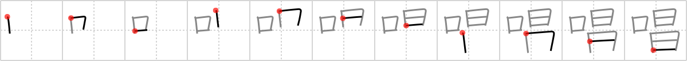

# {唱}

## `chant`

## Strokes: 

## Reading:

### On-Yomi: ショウ &mdash; Kun-Yomi: とな.える

### Examples: 唱える (とな.える)

## Words:

合唱(がっしょう): chorus, singing in a chorus

唱える(となえる): to recite, to chant, to call upon
