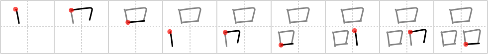

## `goods`

## [9]

## Reading:

### On-Yomi: ヒン、ホン &mdash; Kun-Yomi: しな

## Heisig V6:

As in the character for <i>sparkle</i>, the triplication of a single element in this character indicates &quot;everywhere&quot; or &quot;heaps of.&quot; When we think of <b>goods</b> in modern industrial society, we think of what has been mass-produced - that is to say, produced for the &quot;masses&quot; of open <i>mouths</i> waiting like fledglings in a nest to &quot;consume&quot; whatever comes their way.

## Koohii stories:

1) [<a href="http://kanji.koohii.com/profile/Tsuki11">Tsuki11</a>] 29-10-2007(93): <em>Three boxes</em> of<strong> goods</strong> are devoured by the hungry <em>mouths</em> of waiting consumers.

2) [<a href="http://kanji.koohii.com/profile/graham6565">graham6565</a>] 16-5-2007(68): Three hungry mouths waiting for the<strong> goods</strong> to come.

3) [<a href="http://kanji.koohii.com/profile/mazel">mazel</a>] 16-4-2008(44): Boxes of<strong> goods</strong> stacked on top of the other.

4) [<a href="http://kanji.koohii.com/profile/FuDaWei">FuDaWei</a>] 20-8-2009(7): Three stacked crates of <em>mouth</em>-watering<strong> GOODS</strong>, ready for delivery to the restaurant.

5) [<a href="http://kanji.koohii.com/profile/pjdekl">pjdekl</a>] 27-1-2010(6): Three MOUTHs talk about these <em>three boxes</em> of<strong> GOODS</strong> : the producer’s, the supplier’s and the customer’s.

6) [<a href="http://kanji.koohii.com/profile/sutebun">sutebun</a>] 2-7-2007(5): Three boxes devoid of any<strong> goods</strong>!

7) [<a href="http://kanji.koohii.com/profile/Yokomeshi">Yokomeshi</a>] 4-9-2010(4): &quot;Three floating mouths ate all my<strong> goods</strong>!&quot;.

8) [<a href="http://kanji.koohii.com/profile/yumimuto">yumimuto</a>] 29-7-2008(4): しな。ひん。 A lot of mouths opened desperate for<strong> goods</strong>.

9) [<a href="http://kanji.koohii.com/profile/sethimayne">sethimayne</a>] 22-9-2007(4): Stacked boxes of mass-produced<strong> goods</strong>.

10) [<a href="http://kanji.koohii.com/profile/Thaliel">Thaliel</a>] 8-7-2006(3): 3 boxes with<strong> goods</strong>.
