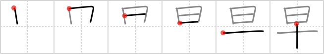

## {26}

## `early`

## [6]

## Reading:

### On-Yomi: ソウ、サッ &mdash; Kun-Yomi: はや.い、はや、はや-、はや.まる、はや.める、さ-

### Examples: 早期 (そうき), 早晩 (そうばん), 早々に (そうそうに), 早い (はや.い), 早まる (はや.まる), 早める (はや.める)

## Words:

お早う(おはよう): Good morning

早急(さっきゅう): urgent

素早い(すばやい): fast, quick, prompt, agile

早める(はやめる): to hasten, to quicken, to expedite, to precipitate, to accelerate

最早(もはや): already, now

早速(さっそく): at once, immediately, without delay, promptly

早口(はやくち): fast-talking

早い(はやい): early
