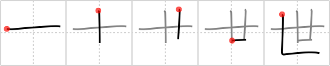

## `generation`

## [5]

## Reading:

### On-Yomi: セイ、セ、ソウ &mdash; Kun-Yomi: よ、さんじゅう

## Koohii stories:

1) [<a href="http://kanji.koohii.com/profile/Christine_Tham">Christine_Tham</a>] 21-7-2007(112): 3 tens =<strong> generation</strong>. 

2) [<a href="http://kanji.koohii.com/profile/CarlKenner">CarlKenner</a>] 5-7-2007(71): They <strong>SAY</strong> a<strong> generation</strong> is <em>ten</em>+<em>ten</em>+<em>ten</em> years, with the big first <em>ten</em> providing a <em>grounding</em>, and the next <em>ten</em> providing a little more <em>grounding</em> for the final <em>ten</em>. But I wish the next<strong> generation</strong> didn&#039;t always <strong>SAY</strong> &quot;<strong>yo!</strong>&quot;. (ON reading is SEI, KUN reading is yo). 

3) [<a href="http://kanji.koohii.com/profile/rakutenka">rakutenka</a>] 30-6-2007(41): The next<strong> generation</strong> is carried by the previous ones. 

4) [<a href="http://kanji.koohii.com/profile/csmdad">csmdad</a>] 9-6-2008(40): That swing has been in that tree for<strong> generation</strong>s. 

5) [<a href="http://kanji.koohii.com/profile/KeroHazel">KeroHazel</a>] 21-8-2008(25): This looks like a picture of a test tube in a holder. Maybe it will be used to create test tube babies for a future<strong> generation</strong>. 

6) [<a href="http://kanji.koohii.com/profile/Thaliel">Thaliel</a>] 8-7-2006(19): Mother with 2 kids sitting in her lap. 

7) [<a href="http://kanji.koohii.com/profile/FloconDeNeige">FloconDeNeige</a>] 13-2-2010(14): <em><strong>よ</strong></em>---In the present<strong> GENERATION</strong>, babies may be produced from TEST TUBES. remember the stand holder at the bottom!! 

8) [<a href="http://kanji.koohii.com/profile/taikura">taikura</a>] 9-11-2008(10): Test tube<strong> GENERATION</strong>. 

9) [<a href="http://kanji.koohii.com/profile/chris.mariles">chris.mariles</a>] 26-11-2009(8): <em>Ten</em> years is a decade; 3 decades is a<strong> generation</strong>. 

10) [<a href="http://kanji.koohii.com/profile/ruschein">ruschein</a>] 4-1-2009(7): Test tube full of sperm to create the next<strong> generation</strong>. 
