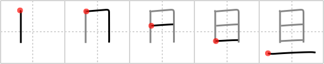

## {30}

## `nightbreak`

## [5]

## Reading:

### On-Yomi: タン、ダン &mdash; Kun-Yomi: あき.らか、あきら、ただし、あさ、あした

## Words:

旦那(だんな): master (of house), husband (informal)

一旦(いったん): once, for a moment, one morning, temporarily
