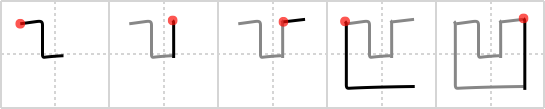

## `concave`

## [5]

## Reading:

### On-Yomi: オウ &mdash; Kun-Yomi: くぼ.む、へこ.む、ぼこ

## Heisig V6:

You couldn't have asked for a better key word for this kanji! Just have a look at it: a perfect image of a <b>concave</b> lens (remembering, of course, that the kanji square off rounded things), complete with its own little &quot;cave.&quot; Now all you have to do is learn how to write it.

## Koohii stories:

1) [<a href="http://kanji.koohii.com/profile/hella">hella</a>] 4-3-2007(105): The letter &quot;U&quot; is<strong> concave</strong>ly written.

2) [<a href="http://kanji.koohii.com/profile/xiteru">xiteru</a>] 9-10-2007(44): <strong>Concave</strong> has a<strong> concave</strong> shape.

3) [<a href="http://kanji.koohii.com/profile/geekdiva">geekdiva</a>] 30-11-2005(22): Stroke order: I took a step down into the cave. A park ranger threw down a line to me from the opposite top ridge, then waited. My friend went down to the lowest passage to look for me, then the ranger threw another line down to her.

4) [<a href="http://kanji.koohii.com/profile/oohansel">oohansel</a>] 21-7-2009(11): <strong>Concave</strong> is like a vagina.

5) [<a href="http://kanji.koohii.com/profile/electrohaze">electrohaze</a>] 16-4-2012(8): Her<strong> CONCAVE</strong> 凹 pussy was fucked by my convex 凸 cock.

6) [<a href="http://kanji.koohii.com/profile/Junsai">Junsai</a>] 27-4-2010(4): There used to be three buildings but one<strong> concave</strong>d.

7) [<a href="http://kanji.koohii.com/profile/JJ_Gregarius">JJ_Gregarius</a>] 12-1-2006(4): Stoke order: the top of<strong> concave</strong> is the strokes of the top of <em>convex</em> in the opposite order, since 1)<strong> concave</strong> is the opposite of <em>convex</em> and 2) that is what makes sense visually. (This assumes that you can visualize<strong> concave</strong> and convex, of course). See my notes for <em>convex</em>.

8) [<a href="http://kanji.koohii.com/profile/sir_sanuk">sir_sanuk</a>] 24-11-2010(3): <strong>Concave</strong> by name,<strong> concave</strong> by nature.

9) [<a href="http://kanji.koohii.com/profile/Razzuel">Razzuel</a>] 29-3-2009(2): This kanji is<strong> concave</strong> like the letter U.

10) [<a href="http://kanji.koohii.com/profile/snifty">snifty</a>] 26-12-2008(2): It&#039;s a<strong> CONCAVE</strong> box. (Duh!) When you reach in the<strong> CONCAVE</strong>-ity, you find a piece of paper, it says &quot;Duh, this means<strong> CONCAVE</strong>, you idiot!&quot;.
