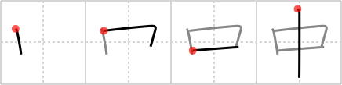

# {中}

## `in`

## Strokes: 4

## Reading:

### On-Yomi: チュウ &mdash; Kun-Yomi: なか、うち、あた.る

### Examples: 中 (なか)

## Words:

心中(しんじゅう): double suicide, lovers suicide

中継(ちゅうけい): relay, hook-up

中指(ちゅうし): middle finger

中傷(ちゅうしょう): slander, libel, defamation

中枢(ちゅうすう): centre, pivot, mainstay, nucleus, backbone, central figure, pillar, key man

中断(ちゅうだん): interruption, suspension, break

中腹(ちゅうっぱら): irritated, offended

中毒(ちゅうどく): poisoning

中立(ちゅうりつ): neutrality

中和(ちゅうわ): neutralize, counteract

途中(つちゅう): on the way, en route

中々(なかなか): very, considerably, easily, readily, by no means (neg), fairly, quite, highly, rather

中程(なかほど): middle, midway

中味(なかみ): contents, interior, substance, filling, (sword) blade

中身(なかみ): contents, interior, substance, filling, (sword) blade

命中(めいちゅう): a hit

夜中(やちゅう): all night, the whole night

連中(れんじゅう): colleagues, company, a lot

御中(おんちゅう): and Company, Messrs.

空中(くうちゅう): sky, air

最中(さいちゅう): in the middle of, height of, midst

集中(しゅうちゅう): concentration, focusing the mind

中(ちゅう): medium, mediocre

中央(ちゅうおう): center, middle, central

中学(ちゅうがく): middle school, junior high school

中間(ちゅうかん): middle, midway, interim

中古(ちゅうこ): used, second-hand, old, Middle Ages

中止(ちゅうし): suspension, stoppage, discontinuance, interruption

中旬(ちゅうじゅん): second third of a month

中心(ちゅうしん): center, core, heart, pivot, emphasis, balance

中性(ちゅうせい): neuter gender, neutral (chem.), indifference, sterility

中世(ちゅうせい): Middle Ages, mediaeval times

中途(ちゅうと): in the middle, half-way

中年(ちゅうねん): middle-aged

中指(なかゆび): middle finger

日中(にっちゅう): daytime, during the day, Sino-Japanese

熱中(ねっちゅう): enthusiasm, zeal, mania

年中(ねんじゅう): whole year, always, everyday

話中(はなしちゅう): while talking, the line is busy

夢中(むちゅう): daze, (in a) trance, ecstasy, delirium, engrossment

夜中(よなか): all night, the whole night

世の中(よのなか): society, the world, the times

背中(せなか): back

中学校(ちゅうがっこう): junior high school

途中(とちゅう): on the way

真ん中(まんなか): middle, center, half way

中(なか): inside, middle, among
