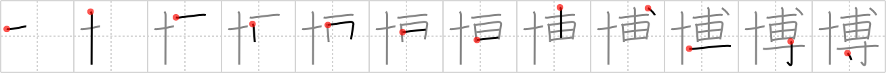

## `Dr.`

## [12]

## Reading:

### On-Yomi: ハク、バク

## Heisig story:

At the left we have the <i>needle</i>; at the right, the kanji for <i>specialty</i>, plus an extra <i>drop</i> at the top. Think of a <b>Dr.</b> who is a <i>specialist</i> with a <i>needle</i> (an acupuncturist) and let the <i>drop</i> at the top represent the period at the end of <b>Dr.</b> In principle we are trying to avoid this kind of device, which plays on abstract grammatical conventions; but I think you will agree, after you have had occasion to use the right side of this kanji in forming other kanji, that the exception is merited in this case.

## Koohii stories:

1) [<a href="http://kanji.koohii.com/profile/sethimayne">sethimayne</a>] 22-9-2007(307): <em>Ten specialties</em> grants you the title of<strong> Dr.</strong> with a dot.

2) [<a href="http://kanji.koohii.com/profile/fuaburisu">fuaburisu</a>] 29-7-2006(109): Watch for <a href="../1694">doctor</a> (#1694 医), the sooner the better! In fact this kanji refers to someone well &quot;learned&quot;, with extensive knowledge. This could apply to any kind of field. The kanji 医 (&quot;doctor&quot;) is directly related to medicine. I would suggest to take away completely the idea of medicine here, and use a popular character whose name includes the keyword such as &quot;Dr. Who&quot;, &quot;Dr. Jekyll&quot;, even &quot;Dr. Dobb&#039;s&quot; if you&#039;re into programming.

3) [<a href="http://kanji.koohii.com/profile/DanielC">DanielC</a>] 13-7-2008(37): <em>Needles</em> are a<strong> Dr.</strong>&#039;s <em>specialty</em>.

4) [<a href="http://kanji.koohii.com/profile/anthropic">anthropic</a>] 7-7-2008(31): <strong>Dr</strong>. Who weaves like a <em>needle</em> through the fabric of time, to <em>drop</em> in unexpectedly has become his <a href="../46">specialty</a> (#46 専) .

5) [<a href="http://kanji.koohii.com/profile/cangy">cangy</a>] 22-4-2010(17): Note: Use <strong>Ph.D.</strong> rather than <strong>Dr.</strong> to avoid confusion with <strong>doctor</strong> and to be more in line with common use of this kanji. <em>Ten</em> <em>specialities</em> grants you the title of <strong>Ph.D.</strong> with a <em>dot</em>.

6) [<a href="http://kanji.koohii.com/profile/LeoOra">LeoOra</a>] 15-1-2008(17): Ten years specializing (4 under graduating, 2 mastering and 4 taking Ph.D) makes you a Doctor, but it leaves with just a drop of hair in your head.

7) [<a href="http://kanji.koohii.com/profile/Hubarem">Hubarem</a>] 8-12-2009(9): It&#039;s not hard to think of a<strong> Dr.</strong> as a &#039;needle specialist&#039;.

8) [<a href="http://kanji.koohii.com/profile/koriiroxx">koriiroxx</a>] 24-1-2011(4): A<strong> Dr.</strong> is somebody who specializes ( 専 ) in blood (&#039;) and needles ( 十 ).

9) [<a href="http://kanji.koohii.com/profile/dotdalidot">dotdalidot</a>] 1-3-2009(4): TEN long years in a SPECIALTY earns you the title of a well learned<strong> Dr.</strong> with the extra dot on special for well learned.

10) [<a href="http://kanji.koohii.com/profile/trevlaw">trevlaw</a>] 10-11-2008(4): I don&#039;t want 10 specialists, I just want my<strong> Dr.</strong> on the dot!!
