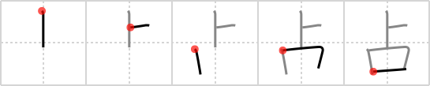

## `fortune-telling`

## [5]

## Reading:

### On-Yomi: セン &mdash; Kun-Yomi: し.める、うらな.う

## Heisig story:

This is one of those kanji that is a real joy of simplicity: a <i>divining rod</i> with a <i>mouth</i>&nbsp;- which translate directly into <b>fortune-telling</b>. Note how the movement from top to bottom (the movement in which the kanji are written) is also the order of the elements which make up our story and of the key word itself: first <i>divining rod</i>, then <i>mouth</i>. This will not always be possible, but where it is, memory has almost no work at all to do.

## Koohii stories:

1) [<a href="http://kanji.koohii.com/profile/Christine_Tham">Christine_Tham</a>] 24-7-2007(147): <strong>Fortune-telling</strong>: using a mouth as a divining rod.

2) [<a href="http://kanji.koohii.com/profile/Hikari">Hikari</a>] 27-8-2007(95): A great number of people who do<strong> fortune-telling</strong> are &quot;almost old&quot;.

3) [<a href="http://kanji.koohii.com/profile/sprutnik">sprutnik</a>] 28-9-2008(37): To do<strong> fortune-telling</strong> put a <em>magic wand</em> in your <em>mouth</em>.

4) [<a href="http://kanji.koohii.com/profile/pandaji">pandaji</a>] 10-10-2007(17): The mouth of a fortune-teller is a superior (above) mouth.

5) [<a href="http://kanji.koohii.com/profile/nihonnicko">nihonnicko</a>] 1-5-2008(13): The old fortune teller was missing an arm.

6) [<a href="http://kanji.koohii.com/profile/CarlKenner">CarlKenner</a>] 5-7-2007(9): She is good at <strong>fortune-telling</strong>. With a <em>divining rod</em> and her <em>mouth</em>, (and by looking at the position of <strong>Uranus</strong> in the sky) <strong>she</strong> may <strong>SEN</strong>SE the future. (Kun readings are urana and shi(me), ON reading is SEN).

7) [<a href="http://kanji.koohii.com/profile/pixiegirl9">pixiegirl9</a>] 31-5-2007(8): The mouth is telling what will happen above and beyond today.

8) [<a href="http://kanji.koohii.com/profile/kirihitokiri">kirihitokiri</a>] 5-3-2008(4): <strong>Fortune telling</strong> is like reflecting the past (<strong>old</strong>) into the future--except we don&#039;t pay attention to the past, all we care about is the words spoken (from the mouth) on the future (line of <strong>old</strong> extending only &quot;forward&quot; in time).

9) [<a href="http://kanji.koohii.com/profile/tomcase7">tomcase7</a>] 15-1-2012(3): A <em>magic wand</em> and a big <em>mouth</em>... All needed to give a<strong> fortune-telling</strong>.

10) [<a href="http://kanji.koohii.com/profile/Hinode">Hinode</a>] 25-12-2011(3): Note: This kanji is also used in &quot;monopolizing&quot; and monopoly &quot; 一人占め &quot; and &quot; 独占 &quot;. I remember this with the famous Oracle of Delphi. It monopolized Greek fortunetelling for a very long time.
