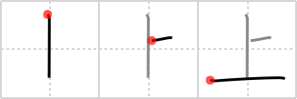

## {49}

## `above`

## [3]

## Reading:

### On-Yomi: ジョウ、ショウ、シャン &mdash; Kun-Yomi: うえ、-うえ、うわ-、かみ、あ.げる、-あ.げる、あ.がる、-あ.がる、あ.がり、-あ.がり、のぼ.る、のぼ.り、のぼ.せる、のぼ.す、よ.す

### Examples: 上旬 (じょうじゅん), 上昇 (じょうしょう), 地上 (ちじょう), 上がる (あ.がる), 上げる (あ.げる), 上 (うえ), 上 (かみ), 上す (のぼ.す), 上せる (のぼ.せる), 上る (のぼ.る)

## Words:

上がり(あがり): slope, advance income, crop yield, ascent, rise, advance, death, spinning, completion, stop, finish, after (rain), ex (official etc.), freshly-drawn green tea (esp. in sushi shops)

上下(うえした): high and low, up and down, unloading and loading, praising and blaming

上手(うわて): upper part, upper stream, left side (of a stage), skillful (only in comparisons), dexterity (only in comparisons)

上回る(うわまわる): to exceed

お手上げ(おてあげ): all over, given in, given up hope, bring to knees

向上(こうじょう): elevation, rise, improvement, advancement, progress

逆上る(さかのぼる): to go back, to go upstream, to make retroactive

参上(さんじょう): calling on, visiting

仕上がり(しあがり): finish, end, completion

仕上げ(しあげ): end, finishing touches, being finished

仕上げる(しあげる): to finish up, to complete

上位(じょうい): superior (rank not class), higher order (e.g. byte), host computer (of connected device)

上演(じょうえん): performance (e.g. music)

上空(じょうくう): sky, the skies, high-altitude sky, upper air

上司(じょうし): superior authorities, boss

上昇(じょうしょう): rising, ascending, climbing

上陸(じょうりく): landing, disembarkation

その上(そのうえ): in addition, furthermore

途上(とじょう): en route, half way

上る(のぼる): to rise, to ascend, to be promoted, to go up, to climb, to go to (the capital), to add up to, to advance (in price), to sail up, to come up (on the agenda)

引き上げる(ひきあげる): to withdraw, to leave, to pull out, to retire

真上(まうえ): just above, right overhead

盛り上がる(もりあがる): to rouse, to swell, to rise

読み上げる(よみあげる): to read out loud (and clearly), to call a roll

売上(うりあげ): amount sold, proceeds

上(かみ): top, head, upper part, emperor, a superior, upper part of the body, the above

仕上がる(しあがる): be finished

上(じょう): first volume, superior quality, top, best, high class, going up

上級(じょうきゅう): advanced level, high grade, senior

上京(じょうきょう): proceeding to the capital (Tokyo)

上下(じょうげ): high and low, up and down, unloading and loading, praising and blaming

上旬(じょうじゅん): first 10 days of month

上達(じょうたつ): improvement, advance, progress

上等(じょうとう): superiority, first-class, very good

立ち上がる(たちあがる): stand up

頂上(ちょうじょう): top, summit, peak

出来上がり(できあがり): finish, completion, ready, made for, cut out

出来上がる(できあがる): be finished, be ready, by definition, be very drunk

取り上げる(とりあげる): take up, pick up, disqualify, confiscate, deprive

上り(のぼり): ascent, climbing, up-train (i.e. going to Tokyo)

目上(めうえ): superior(s), senior

持ち上げる(もちあげる): raise, lift up, flatter

上がる(あがる): go up, rise

以上(いじょう): more than, over

屋上(おくじょう): the roof top

差し上げる(さしあげる): give

召し上がる(めしあがる): eat (polite)

申し上げる(もうしあげる): say (polite)

上げる(あげる): give, raise, elevate, praise, increase, advance, promote, admit, offer, present, leave with, finish, observe, perform, quote, mention, bear (a child), improve (talents), arrest, engage, fry

上(うえ): top, best, superior quality, going up, presenting, showing, aboard a ship or vehicle, from the standpoint of, as a matter of (fact)

上着(うわぎ): coat, tunic, jacket, outer garment

上手(じょうず): skill, skillful, dexterity
