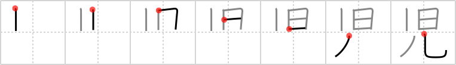

# {児}

## `newborn babe`

## Strokes: 7

## Reading:

### On-Yomi: ジ、ニ、ゲイ &mdash; Kun-Yomi: こ、-こ、-っこ

### Examples: 児童 (じどう), 幼児 (ようじ), 優良児 (ゆうりょうじ)

## Words:

児(こ): child, the young of animals

孤児(こじ): orphan

小児科(しょうにか): pediatrics

育児(いくじ): childcare, nursing, upbringing

児童(じどう): children, juvenile

幼児(ようじ): infant, baby, child
