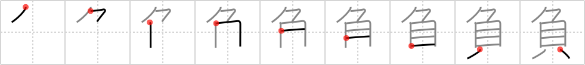

# {負}

## Strokes: 9

## Reading:

### On-Yomi: フ &mdash; Kun-Yomi: ま.ける、ま.かす、お.う

### Examples: 負う (お.う), 負かす (ま.かす), 負ける (ま.ける)

## Words:

負う(おう): to bear, to owe

御負け(おまけ): a discount, a prize, something additional, bonus, an extra, an exaggeration

背負う(しょう): to be burdened with, to carry on back or shoulder

勝負(しょうぶ): victory or defeat, match, contest, game, bout

負債(ふさい): debt, liabilities

負傷(ふしょう): injury, wound

負担(ふたん): burden, charge, responsibility

負かす(まかす): to defeat

背負う(せおう): be burdened with, carry on back or shoulder

負け(まけ): defeat, loss, losing (a game)

負ける(まける): lose
