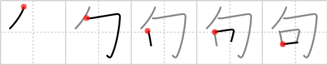

# {65}

## `phrase`

## [5]

## Reading:

### On-Yomi: ク

### Examples: 句 (く)

## Words:

佳句(かく): beautiful passage of literature

語句(ごく): words, phrases

句(く): phrase, clause, sentence, passage, paragraph, expression, line, verse, stanza, 17-syllable poem

句読点(くとうてん): punctuation marks

俳句(はいく): 17-syllable poem

文句(もんく): phrase, complaint
