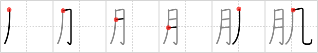

## `texture`

## [6]

## Reading:

### On-Yomi: キ &mdash; Kun-Yomi: はだ

## Koohii stories:

1) [<a href="http://kanji.koohii.com/profile/dingomick">dingomick</a>] 6-2-2007(245): When you expose your <em>flesh</em> to the <em>wind</em> it gets <strong>textured</strong>: goosebumps! 

2) [<a href="http://kanji.koohii.com/profile/Rachael">Rachael</a>] 25-1-2008(136): The <em>moon</em>&#039;s lack of <em>wind</em> preserves its<strong> texture</strong>. 

3) [<a href="http://kanji.koohii.com/profile/Tsuki11">Tsuki11</a>] 30-10-2007(36): Because the <em>moon</em> has no <em>wind</em> the<strong> texture</strong> of it&#039;s cratered surface never changes or erodes. 

4) [<a href="http://kanji.koohii.com/profile/Loren">Loren</a>] 17-8-2008(20): The Moon And The Wind Create The Sea&#039;s Wavey <strong>Texture</strong>! 

5) [<a href="http://kanji.koohii.com/profile/Teango">Teango</a>] 12-3-2010(7): A month of wind changes the<strong> texture</strong> of your skin. 

6) [<a href="http://kanji.koohii.com/profile/jabberwockychortles">jabberwockychortles</a>] 10-1-2011(6): Moisturizer helps protect the <em>flesh</em> from having a<strong> texture</strong> from being in the <em>wind</em>. 

7) [<a href="http://kanji.koohii.com/profile/PeterJD">PeterJD</a>] 22-3-2008(6): はだ　TEXTURE; SKIN. ”The FLESH (part of the body) that you expose to the WIND is your SKIN (note the order), which eventually becomes<strong> texture</strong>d as a result of such exposure.&quot; Eg.　  <a href="http://jisho.org/kanji/details/鳥肌が立つ">鳥肌が立つ</a>  　（とりはだがたつ） to get goosebumps.   <a href="http://jisho.org/kanji/details/肌寒い">肌寒い</a>  　chilly. 

8) [<a href="http://kanji.koohii.com/profile/Christine_Tham">Christine_Tham</a>] 22-7-2007(6): The moon seems to have a different<strong> texture</strong> in the wind. 

9) [<a href="http://kanji.koohii.com/profile/indigo360">indigo360</a>] 1-3-2009(5): FLESH + WIND =<strong> TEXTURE</strong>D=SKIN_____ FLESH affectd by wind, changes the<strong> texture</strong> of the SKIN. Also:   <a href="http://jisho.org/kanji/details/肌">肌</a>   【はだ】 (n,n-suf) (1) skin; body; (2) grain (e.g. of wood);<strong> texture</strong>;. 

10) [<a href="http://kanji.koohii.com/profile/UKLukeEU">UKLukeEU</a>] 30-12-2006(5): My companion had no<strong> texture</strong>, it was as if she were a ghost! 
