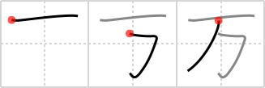

## `ten thousand`

## [3]

## Reading:

### On-Yomi: マン、バン &mdash; Kun-Yomi: よろず

## Heisig story:

Japanese counts higher numbers in units of <b>ten thousand</b>, unlike the West, which advances according to units of one thousand. (Thus, for instance, 40,000 would be read &quot;four <b>ten-thousands</b>&quot; by a Japanese.) Given that the comma is used in larger numbers to <i>bind up</i> a numerical unit of one thousand, the elements for <i>one</i> and <i>bound up</i> naturally come to form <b>ten thousand</b>. The order of strokes here needs special attention, both because it falls outside the general principles we have learned already, and because it involves writing the element for <i>bound up</i> in an order opposite to the one we learned. If it is any consolation, this exception is consistent every time these three strokes come together.

## Koohii stories:

1) [<a href="http://kanji.koohii.com/profile/Tsuki11">Tsuki11</a>] 30-10-2007(249): I <em>bound</em><strong> ten thousand</strong> dollars together and hid it under the <em>floor</em>.

2) [<a href="http://kanji.koohii.com/profile/Sleepyhead">Sleepyhead</a>] 30-1-2009(87): IT&#039;S OVER 9000!!!!!!

3) [<a href="http://kanji.koohii.com/profile/Starkii">Starkii</a>] 10-6-2008(58): It looks like a T and an H put together.

4) [<a href="http://kanji.koohii.com/profile/Narges">Narges</a>] 13-11-2006(49): We have &quot;one&quot; at the top and if you turn the kanji 90 degrees you will see arabic 4 shich means it has four zeros in front of it!

5) [<a href="http://kanji.koohii.com/profile/Tatiana">Tatiana</a>] 18-10-2006(21): Think of Tao:<strong> ten thousand</strong> things are all <em>bound up</em> into <em>one</em>.

6) [<a href="http://kanji.koohii.com/profile/Nihonnub">Nihonnub</a>] 30-5-2009(19): Looks like <em>T</em> and <em>h</em>, sharing the same stem.. <em>Th</em> are the first two letters in thousand.

7) [<a href="http://kanji.koohii.com/profile/coolbananas">coolbananas</a>] 30-1-2006(12): This kanji makes me think of money in Japan. two primitives: &quot;one&quot; and &quot;bound up&quot; Put them together by thinking of 10,000 yen notes bundled together in batches, each batch with one note wrapped around it rather than a rubber band or string, etc.

8) [<a href="http://kanji.koohii.com/profile/Scotchpie">Scotchpie</a>] 3-10-2010(8): T is for TEN as Th is for a THOUSAND.

9) [<a href="http://kanji.koohii.com/profile/SammyB">SammyB</a>] 29-5-2008(8): I was bound for<strong> ten thousand</strong> years to the ceiling!

10) [<a href="http://kanji.koohii.com/profile/weele">weele</a>] 23-8-2012(5): Only<strong> ten thousand</strong> yen for a pair of those sex shackles you can tie to the ceiling!
