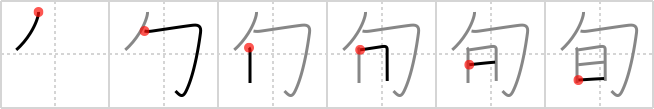

## `decameron`

## [6]

## Reading:

### On-Yomi: ジュン、シュン

## Heisig story:

There simply is not a good phrase in English for the block often days which this character represents. So we resurrect the classical phrase, <b>decameron</b>, whose connotations the tales of Boccaccio have done much to enrich. Actually, it refers to a journey of ten <i>days</i> taken by a band of people - that is, a group of people <i>bound together</i> for the <i>days</i> of the <b>decameron</b>.

## Koohii stories:

1) [<a href="http://kanji.koohii.com/profile/yukkuri_kame">yukkuri_kame</a>] 6-4-2009(218): Hesig should be BOUND for a DAY (or maybe 10 days - a<strong> decameron</strong>) for calling this Kanji<strong> DECAMERON</strong>. See <a href="../v4/809">martyrdom</a> (#809 殉).

2) [<a href="http://kanji.koohii.com/profile/Pulse">Pulse</a>] 18-3-2012(165): <strong>Hint:</strong> <em>Here&#039;s info from Wikipedia regarding why this kanji exists, which helped me remember it:</em> [Japan also divides the month roughly into three 10-day periods. Each is called a jun ( 旬 ). The first is jōjun ( 上旬 ); the second, chūjun ( 中旬 ); the last, gejun ( 下旬 ). These are frequently used to indicate approximate times, for example, &quot;the temperatures are typical of the jōjun of April&quot;; &quot;a vote on a bill is expected during the gejun of this month.&quot;].

3) [<a href="http://kanji.koohii.com/profile/blahdi">blahdi</a>] 8-9-2009(85): What the fuck?

4) [<a href="http://kanji.koohii.com/profile/Christine_Tham">Christine_Tham</a>] 22-7-2007(70): If you bind up ten days, you get a<strong> decameron</strong>.

5) [<a href="http://kanji.koohii.com/profile/panikbuton">panikbuton</a>] 20-1-2008(33): For producing Titanic, James<strong> deCameron</strong> should be bound for 10 days.

6) [<a href="http://kanji.koohii.com/profile/Perry">Perry</a>] 29-3-2009(31): HINT: All the stories seem to have &#039;10&#039; in them, but the primitive isn&#039;t featured, which is confusing. So my story: How many days were bound up in a<strong> decameron</strong>? It doesn&#039;t matter!

7) [<a href="http://kanji.koohii.com/profile/kat1420">kat1420</a>] 10-3-2008(22): It would tie up a whole day to read The<strong> Decameron</strong>.

8) [<a href="http://kanji.koohii.com/profile/fjolnir">fjolnir</a>] 10-10-2009(12): Heisig should be <em>bound</em> up for <strong>10 <em>day</em>s</strong> for calling this kanji<strong> decameron</strong>!

9) [<a href="http://kanji.koohii.com/profile/Asayoru">Asayoru</a>] 11-11-2010(6): The Japanese divide the months into three parts. Each part is made up of <strong>ten days</strong>. The <em>day</em>s are <em>bound</em> together so they make more sense.

10) [<a href="http://kanji.koohii.com/profile/sdnnet3">sdnnet3</a>] 18-1-2009(6): How many days are bound up in a<strong> decameron</strong>?
