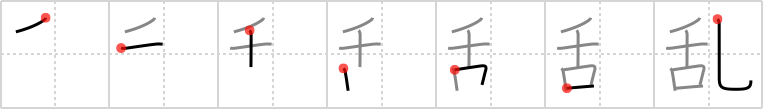

## {72}

## `riot`

## [7]

## Reading:

### On-Yomi: ラン、ロン &mdash; Kun-Yomi: みだ.れる、みだ.る、みだ.す、みだ、おさ.める、わた.る

### Examples: 乱す (みだ.す), 乱れる (みだ.れる)

## Words:

内乱(ないらん): civil war, insurrection, rebellion, domestic conflict

反乱(はんらん): insurrection, mutiny, rebellion, revolt, uprising

乱す(みだす): to throw out of order, to disarrange, to disturb

乱れる(みだれる): to get confused, to be disordered, to be disturbed

混乱(こんらん): disorder, chaos, confusion, mayhem

乱暴(らんぼう): rude, violent, rough, lawless, unreasonable, reckless
