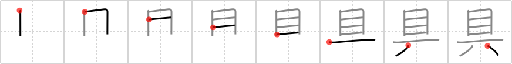

# {74}

## `tool`

## [8]

## Reading:

### On-Yomi: グ &mdash; Kun-Yomi: そな.える、つぶさ.に

## Words:

雨具(あまぐ): rain gear

敬具(けいぐ): Sincerely yours

夜具(やぐ): bedding

絵の具(えのぐ): colors, paints

家具(かぐ): furniture

器具(きぐ): utensil

具体(ぐたい): concrete, tangible, material

具える(そなえる): furnish, provide for, equip, install, have ready, prepare for, possess, have, be endowed with, be armed with

文房具(ぶんぼうぐ): stationery

具合(ぐあい): condition

道具(どうぐ): tool
