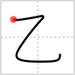

## `fish guts`

## [1]

## Reading:

### On-Yomi: オツ、イツ &mdash; Kun-Yomi: おと-、きのと

## Heisig story:

The kanji shown here actually represents the &quot;second&quot; position in the old Chinese zodiac, which the Japanese still use as an alternate way of enumeration, much the same way that English will revert to Roman numerals. Among its many other meanings are &quot;pure,&quot; &quot;tasteful,&quot; &quot;quaint,&quot; and - get this! - <b>fish guts</b>. Since it is a pictograph of a fishhook, it should not be hard to associate it with the key word.

## Koohii stories:

1) [<a href="http://kanji.koohii.com/profile/Jeremy">Jeremy</a>] 11-7-2006(113): This is a fish hook, that pulls out the<strong> fishguts</strong>.

2) [<a href="http://kanji.koohii.com/profile/bakamono">bakamono</a>] 20-8-2007(41): You cut a fish in a z shape on the belly to make it easier to open the fish and rip out its <strong>fish guts</strong> silly!

3) [<a href="http://kanji.koohii.com/profile/Danieru">Danieru</a>] 3-11-2007(35): &quot;Knife goes in, guts come out&quot; (-Bart Simpson&#039;s mantra as he guts fish in &quot;30 Minutes Over Tokyo&quot;). To be more specific: first, cut a 乙 -shape in the belly of the fish, <strong>second</strong>, pull the<strong> fishguts</strong> out. (Note that the most common meaning of this kanji is not &#039;fishguts&#039; as Heisig connotates, but &#039;second&#039;).

4) [<a href="http://kanji.koohii.com/profile/Cruger">Cruger</a>] 26-7-2008(25): Fishgutz.

5) [<a href="http://kanji.koohii.com/profile/GrimPanda">GrimPanda</a>] 21-9-2010(18): Really this will rarely be seen as<strong> fishguts</strong> as a Kanji, usually it&#039;s 2nd party, or latter, generally always meaning 2nd in some way. It&#039;s easy to remember this as &quot;2nd&quot; since it looks like a 2. Then just remember it&#039;s a fishhook primitive like any other kanji that changes it&#039;s meaning as a primitive.

6) [<a href="http://kanji.koohii.com/profile/darthvivi">darthvivi</a>] 6-10-2007(12): Imagine if the Zodiac Killer targeted fish instead of people. He would kill fish and leave<strong> fishguts</strong> spewing all over the scene of the crime. Then he would leave his infamous mark: the mark of the <em>Zodiac</em>. (A slightly curved Z).

7) [<a href="http://kanji.koohii.com/profile/ochaiscream">ochaiscream</a>] 1-4-2009(10): Zorro left his initial in the<strong> fishguts</strong>.

8) [<a href="http://kanji.koohii.com/profile/lugelen">lugelen</a>] 10-5-2011(6): <strong>Fishguts</strong> are my <strong>2nd</strong> favorite food.

9) [<a href="http://kanji.koohii.com/profile/romethebeast">romethebeast</a>] 8-12-2009(6): Ze fish are caught weeth ze fishgut bait on ze hook.

10) [<a href="http://kanji.koohii.com/profile/jonusbalonus">jonusbalonus</a>] 31-12-2012(5): <strong>FishgutZ!</strong>.
