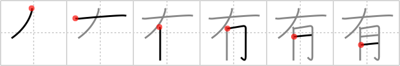

## `possess`

## [6]

## Reading:

### On-Yomi: ユウ、ウ &mdash; Kun-Yomi: あ.る

### Examples: 有益 (ゆうえき), 所有 (しょゆう), 特有 (とくゆう), 有 (ある)

## Words:

有難う(ありがとう): Thank you

有様(ありさま): state, condition, circumstances, the way things are or should be, truth

有りのまま(ありのまま): the truth, fact, as it is, frankly

有る(ある): to be, to have

国有(こくゆう): national ownership

固有(こゆう): characteristic, tradition, peculiar, inherent, eigen-

私有(しゆう): private ownership

特有(とくゆう): characteristic (of), peculiar (to)

有益(ゆうえき): beneficial, profitable

有機(ゆうき): organic

有する(ゆうする): to own, to be endowed with

有望(ゆうぼう): good prospects, full of hope, promising

有力(ゆうりょく): influence, prominence, potent

有難い(ありがたい): grateful, thankful, welcome, appreciated

有無(うむ): yes or no, existence, presence or absence marker

有効(ゆうこう): validity, availability, effectiveness

有能(ゆうのう): able, capable, efficient, skill

有利(ゆうり): advantageous, better, profitable, lucrative

有料(ゆうりょう): admission-paid, toll

有名(ゆうめい): fame

## Koohii stories:

1) [<a href="http://kanji.koohii.com/profile/ruisu">ruisu</a>] 7-9-2007(221): <strong>Possess</strong>ed by the Earth&#039;s gravity, the moon stays by its side. 

2) [<a href="http://kanji.koohii.com/profile/notgoing2argue">notgoing2argue</a>] 12-3-2007(47): By my side I<strong> POSSESS</strong> a <em> moon of flesh</em>, better known as your big ass! 

3) [<a href="http://kanji.koohii.com/profile/PeterJD">PeterJD</a>] 18-1-2007(32): To<strong> possess</strong> = have or own something. In the fight for survival in prehistoric times, the most important thing to<strong> possess</strong> was meat by your side which could be eaten at any time. Imagine a caveman after a hunt having meat by his side. 

4) [<a href="http://kanji.koohii.com/profile/Jeromin">Jeromin</a>] 21-12-2008(29): The moon stood by my side: I was<strong> possess</strong>ed, a lunatic. 

5) [<a href="http://kanji.koohii.com/profile/xzseth">xzseth</a>] 15-4-2009(21): With the moon at my side I transform into a werewolf. Oh no, I am<strong> possess</strong>ed. 

6) [<a href="http://kanji.koohii.com/profile/peepiceek">peepiceek</a>] 28-4-2008(15): I<strong> possess</strong> <em>ten</em> <em>moon</em>s... (It&#039;s a bit twisted, I know.). 

7) [<a href="http://kanji.koohii.com/profile/j0k0m0">j0k0m0</a>] 19-2-2009(11): Besides flesh, what do i<strong> possess</strong>? 

8) [<a href="http://kanji.koohii.com/profile/lostdog">lostdog</a>] 20-12-2007(9): If a vegetarian carried <em>meat</em> <em>by their side</em>, someone could think they were<strong> possess</strong>ed! 

9) [<a href="http://kanji.koohii.com/profile/potempkin">potempkin</a>] 28-8-2008(7): Batman <strong>possess</strong>es a lot of cool gadgets that I don&#039;t <strong>have</strong>. He <strong>has</strong> them on the <em>side</em> of his <em>body</em> in his utility belt. Shark Repellent Bat Spray? Yeah, he <strong>has</strong> that. 

10) [<a href="http://kanji.koohii.com/profile/torokun">torokun</a>] 6-7-2010(5): The moon is<strong> possess</strong>ed by the Earth&#039;s gravity, so the <em>moon</em> stays <em>by its side</em>. 
