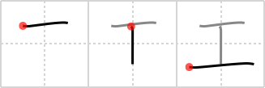

## `craft`

## [3]

## Reading:

### On-Yomi: コウ、ク、グ

## Heisig story:

The pictograph of an I beam, like the kind used in heavy construction work on buildings and bridges, gives us the character for <b>craft</b> in general.

## Premitive:

As a primitive element, the key word retains the meaning of craft and also takes on the related meanings of I BEAM and Wyglada jak kowadlo to tworzenia. ARTIFICIAL. SIMPLE Pictograph kowadla.

## Koohii stories:

1) [<a href="http://kanji.koohii.com/profile/scottamus">scottamus</a>] 15-11-2005(78): I consider<strong> craft</strong> to be one of the harder primitives to use in stories so I&#039;ve personified it as Bender the<strong> craft</strong>y robot from Futurama who was designed to bend I-beams.

2) [<a href="http://kanji.koohii.com/profile/C00ki3M0nst3r">C00ki3M0nst3r</a>] 29-8-2007(37): I<strong> craft</strong>y.

3) [<a href="http://kanji.koohii.com/profile/stereovibe">stereovibe</a>] 4-2-2008(30): Icraft, beautifully<strong> craft</strong>ed by apple!

4) [<a href="http://kanji.koohii.com/profile/brandon7s">brandon7s</a>] 1-10-2009(23): I-beams are used to<strong> CRAFT</strong> skyscrapers.

5) [<a href="http://kanji.koohii.com/profile/TerryS">TerryS</a>] 22-11-2008(23): I<strong> CRAFT</strong>ed an <em>artificial I-beam</em>.

6) [<a href="http://kanji.koohii.com/profile/deebo">deebo</a>] 1-8-2008(13): The pattern that bricks make. Building is a<strong> craft</strong>.

7) [<a href="http://kanji.koohii.com/profile/CSBarnes">CSBarnes</a>] 9-11-2008(11): Who <strong>crafts</strong>? <em>I</em><strong> craft</strong>!

8) [<a href="http://kanji.koohii.com/profile/Aploosh">Aploosh</a>] 27-6-2007(11): When you write this Kanji, you&#039;re writing the letter &quot;T&quot; and then 一 (ichi). So you can make a sentence like &quot;T-ichi me how to make this<strong> CRAFT</strong>.&quot; or &quot;T-ichi me how to play World of WarCRAFT.&quot;, etc.

9) [<a href="http://kanji.koohii.com/profile/mtheory7">mtheory7</a>] 9-8-2009(5): Simply, this is the cross section of a I-beam used to<strong> craft</strong> a building.

10) [<a href="http://kanji.koohii.com/profile/tritonxg">tritonxg</a>] 7-1-2010(4): [FR]<strong>travaux</strong> japlt:N3 <strong>KÔ KU </strong>kanji&amp;kana:139 <em>pictogramme </em><strong> TRAVAUX</strong> d&#039;<strong>H</strong>ercule : un H couché sur le côté 工員 【こういん】factory worker 工学者 【こうがくしゃ】engineer 工業地区 【こうぎょうちく】industrial zone 工具入 【こうぐいれ】toolbox 大工 【だいく】carpenter 女工 【じょこう】ouvrière 工学 【こうがく】technologie 人工 【じんこう】artificial.
