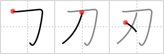

## `blade`

## [3]

## Reading:

### On-Yomi: ジン、ニン &mdash; Kun-Yomi: は、やいば、き.る

## Heisig V6:

Think of using a <i>dagger</i> as a razor <b>blade</b>, and it shouldn't be hard to imagine cutting yourself. See the little <i>drop of</i> blood clinging to the <b>blade</b>?

## Koohii stories:

1) [<a href="http://kanji.koohii.com/profile/thatkidpercy">thatkidpercy</a>] 16-11-2007(190): The part of a <em>sword</em> where a <em>drop of blood</em> can usually be found is the<strong> blade</strong>.

2) [<a href="http://kanji.koohii.com/profile/Wosret">Wosret</a>] 29-11-2008(54): <strong>A drop of</strong> blood on the<strong> blade</strong> of my sword.

3) [<a href="http://kanji.koohii.com/profile/Twentytw0">Twentytw0</a>] 3-7-2008(11): Imagine<strong> Blade</strong> (Wesley Snipes) wiping the <em>drops</em> of blood from his <em>sword</em> after killing some vampires.

4) [<a href="http://kanji.koohii.com/profile/canji">canji</a>] 31-7-2008(9): How do you know it is a real <em>sword</em>? There is a <em>drop</em> of blood on the <strong>blade</strong>.

5) [<a href="http://kanji.koohii.com/profile/jabberwockychortles">jabberwockychortles</a>] 27-1-2009(6): There&#039;s a <em>drop</em> of blood on the<strong> blade</strong> of the <em>sword</em>.

6) [<a href="http://kanji.koohii.com/profile/atomiton">atomiton</a>] 27-3-2009(5): Sword becomes a<strong> blade</strong> when it has drawn its first drop of blood.

7) [<a href="http://kanji.koohii.com/profile/gyouza">gyouza</a>] 15-6-2010(4): After cutting off poor カ&#039;s head, a <em>drop</em> of blood still clings to the <strong>blade</strong> of the <em>sword</em>.

8) [<a href="http://kanji.koohii.com/profile/JHastings">JHastings</a>] 5-3-2011(3): A<strong> blade</strong> of a <em>sword</em> with a <em>drop</em> of blood.

9) [<a href="http://kanji.koohii.com/profile/loupblanc">loupblanc</a>] 6-9-2008(3): The<strong> blade</strong> if the part of the sword that can make you bleed.

10) [<a href="http://kanji.koohii.com/profile/yurypetrov">yurypetrov</a>] 16-4-2011(2): There is a drop of blood on the sword&#039;s<strong> blade</strong>.
