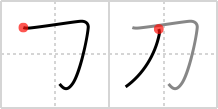

## `sword`

## [2]

## Reading:

### On-Yomi: トウ &mdash; Kun-Yomi: かたな、そり

## Heisig story:

Although this character no longer looks very much like a <b>sword</b>, it does have some resemblance to the handle of the <b>sword</b>. This is to our advantage, in that it helps us keep make a distinction between two primitive elements based on this kanji.

## Premitive:

In the form of the kanji, this primitive means a DAGGER. When it appears to the right of another element, it is commonly stretched out like this § and takes the sense of a great and flashing SABER, a meaning it gets from a character we shall learn later (FRAME 1671 剣). SIMPLE Handle of a sword.

## Koohii stories:

1) [<a href="http://kanji.koohii.com/profile/romanrozhok">romanrozhok</a>] 15-8-2008(134): This<strong> SWORD</strong> is so sharp, it can cut the top part of カ off in カタナ.

2) [<a href="http://kanji.koohii.com/profile/mrcool">mrcool</a>] 22-5-2008(47): If you look really close this kanji looks like a person bending over touching the ground Waiting for someone to put there<strong> sword</strong> in his ass!

3) [<a href="http://kanji.koohii.com/profile/saturnine13">saturnine13</a>] 3-9-2009(44): Samurai carry two<strong> sword</strong>s on their belt: a curved katana and a straighter, shorter wakizashi.

4) [<a href="http://kanji.koohii.com/profile/snifty">snifty</a>] 17-2-2009(15): Looks like the handle on a pirate cutlass, a kind of<strong> sword</strong>.

5) [<a href="http://kanji.koohii.com/profile/fuaburisu">fuaburisu</a>] 6-1-2006(14): Note : this is the kanji for the famous Japanese<strong> sword</strong>, also pronounced かたな (katana). As a primitive when it is compressed on the right of a kanji, its meaning becomes &quot;saber&quot;. In that case I like to associate the image of a ninja, making sure to keep it distinct from the &quot;samurai&quot;. The samurai would be the historical japanese warrior, while the ninja would be the more stealthy character popularised through modern martial arts movies.

6) [<a href="http://kanji.koohii.com/profile/Ramchip">Ramchip</a>] 16-11-2006(7): Make sure not to cross the two strokes, or you might confuse it with <a href="../v4/858">power</a> (#858 力).

7) [<a href="http://kanji.koohii.com/profile/kasuka">kasuka</a>] 15-1-2012(5): The<strong> sword</strong> cut off the top of　ka.

8) [<a href="http://kanji.koohii.com/profile/Ningen">Ningen</a>] 15-7-2008(4): The blade is broken at the handle so there&#039;s no telling if it was a<strong> SWORD</strong>, DAGGER or SABER. Just goes to show you that a<strong> SWORD</strong> is not the same as POWER (the kanji).

9) [<a href="http://kanji.koohii.com/profile/mdspencer">mdspencer</a>] 29-2-2008(4): An old rapier style<strong> sword</strong> with the blade missing. (To clarify the image, the left hand curved stroke is the handle and the more vertical stroke is the hand guard).

10) [<a href="http://kanji.koohii.com/profile/spike287">spike287</a>] 23-7-2010(3): It really looks like a pictograph of someone down on their knees with a<strong> sword</strong> on their side, waiting for that surprise attack.
