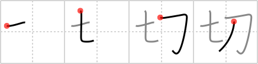

## `cut`

## [4]

## Reading:

### On-Yomi: セツ、サイ &mdash; Kun-Yomi: き.る、-き.る、き.り、-き.り、-ぎ.り、き.れる、-き.れる、き.れ、-き.れ、-ぎ.れ

## Heisig story:

To the right we see the <i>dagger</i> and next to it the number <i>seven</i> whose primitive meaning we decided would be <i>diced</i> (Frame 7). It is hard to think of <b>cutting</b> anything with a knife without imagining one of those skillful Japanese chefs. Only let us say that he has had too much to drink at a party, grabs a <i>dagger</i> lying on the mantelpiece and starts <i>dicing</i> up everything insight, starting with the hors d'oeuvres and going on to the furniture and the carpets....

## Koohii stories:

1) [<a href="http://kanji.koohii.com/profile/Christine_Tham">Christine_Tham</a>] 23-7-2007(260): The seven samurai used their swords to<strong> cut</strong> their opponents.

2) [<a href="http://kanji.koohii.com/profile/phauna">phauna</a>] 6-1-2008(83): Seven swords<strong> cut</strong> better than one.

3) [<a href="http://kanji.koohii.com/profile/dwhitman">dwhitman</a>] 10-10-2007(41): The <em>seven</em> samurai used their <em>swords</em> to<strong> cut</strong> vegetables. (Easier to remember if it&#039;s a little silly. Imagine the seven samurai flailing about the kitchen dangerously swinging their katanas about, to<strong> cut</strong> stuff up for dinner.).

4) [<a href="http://kanji.koohii.com/profile/ihatobu">ihatobu</a>] 25-2-2007(35): Actors filming &quot;The Seven Samurai&quot; respond to the director&#039;s command, &quot;CUT!&quot; by wielding their swords.

5) [<a href="http://kanji.koohii.com/profile/eigoosaka">eigoosaka</a>] 27-12-2008(19): Be careful!!! Snow White has gone insane and<strong> CUT</strong> up the SEVEN dwarfs with a DAGGER.

6) [<a href="http://kanji.koohii.com/profile/terozen">terozen</a>] 25-3-2012(5): If you attach a <em>spoon</em> to a <em>sword</em>, you can still get <strong>cut</strong>! [Like pensa said, the element on the left is a SPOON, not a seven.].

7) [<a href="http://kanji.koohii.com/profile/brainrobert1">brainrobert1</a>] 17-2-2011(5): Seven + swords =<strong> cut</strong>/eager/keen. Seven keen swords for seven eager samurai to<strong> cut</strong> up bandits. kiru 切る to<strong> cut</strong>; setsu 切 earnest/acute. taisetsu 大切 important/precious.

8) [<a href="http://kanji.koohii.com/profile/dacker">dacker</a>] 1-5-2009(5): If you try to juggle <strong>seven</strong> <strong>sword</strong>s you will <strong>cut</strong> yourself.

9) [<a href="http://kanji.koohii.com/profile/johanvg">johanvg</a>] 11-7-2006(5): Seven swords<strong> cut</strong> better than one.

10) [<a href="http://kanji.koohii.com/profile/mrddrr">mrddrr</a>] 23-6-2009(4): Seven swords can<strong> cut</strong> anything.

### {V4: 85, V6: 89}
