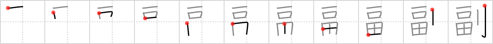

## `vice-`

## [11]

## Reading:

### On-Yomi: フク

## Heisig V6:

The key word <b>vice</b> has the sense of someone second-in-command. The great and flashing <i>saber</i> to the right (its usual location, so you need not worry about where to put it from now on) and the <i>wealth</i> on the left combine to create an image of dividing one's property to give a share to one's <b>vice</b>-<i>wealth</i> holder.

## Koohii stories:

1) [<a href="http://kanji.koohii.com/profile/geisel">geisel</a>] 27-4-2007(174): The <em>wealthy</em> guy with the <em>sword</em> standing next to the king, that&#039;s the<strong> vice-</strong>roy who does all the dirty work.

2) [<a href="http://kanji.koohii.com/profile/applesuki">applesuki</a>] 10-2-2006(106): <strong>Vice-</strong>president Cheney: a wealthy saber rattler.

3) [<a href="http://kanji.koohii.com/profile/demiurge">demiurge</a>] 22-3-2008(92): <strong>Vice-</strong>President Cheney shot a man in the face while hunting, as is common knowledge, I imagine. So think of it like a Clue answer and you will remember the symbol order as well. <em>One</em> shot, in the <em>mouth</em>, on a <em>field</em>, with a <em>gun</em> (a modern-day sword).

4) [<a href="http://kanji.koohii.com/profile/Jeromin">Jeromin</a>] 21-12-2008(18): The Shogun&#039;s second in command, handling the wages: One mouth controlling the rice fields to pay for the swords (Japanese samurai got paid in rice).

5) [<a href="http://kanji.koohii.com/profile/frychiko">frychiko</a>] 25-5-2008(17): The VICE president protected my WEALTH with his army of SABER wielding soldiers.

6) [<a href="http://kanji.koohii.com/profile/Narges">Narges</a>] 22-11-2006(16): He has one mouth, one piece of land and one sword so he is<strong> vice-</strong>sth; if he had two of each and one woman he would be the boss!

7) [<a href="http://kanji.koohii.com/profile/Murjab">Murjab</a>] 26-8-2007(14): The <strong>vice</strong>-ruler is the <em>right-hand</em> man of the <em>wealthy</em> ruler. As the right hand man, he has to do some of the dirty work and thus carries a <em>sword</em>... Also, I think of Teddy Roosevelt when he was <strong>vice</strong>-president, possibly chosen to run with McKinley because he was a [weapon-toting] war hero.

8) [<a href="http://kanji.koohii.com/profile/Hubarem">Hubarem</a>] 10-12-2009(7): If you cut your <em>wealth</em> (with a <em>saber</em>) and share it, you are<strong> vice-</strong>owners.

9) [<a href="http://kanji.koohii.com/profile/pazustep">pazustep</a>] 14-7-2008(7): The <strong>vice-</strong>roy is a <em>wealthy</em>, fat man that eats all the crops, and then goes bully everyone with his <em>saber</em>.

10) [<a href="http://kanji.koohii.com/profile/stereovibe">stereovibe</a>] 5-2-2008(7): The<strong> vice-</strong>ruler is <em>wealthy</em>, but he has to carry a <em>saber</em> to lead the forces.
