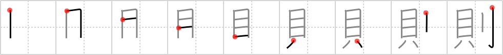

## `rule`

## [9]

## Reading:

### On-Yomi: ソク &mdash; Kun-Yomi: のっと.る

## Heisig story:

The character depicts a <i>clam</i> alongside a great and flashing <i>saber</i>. Think of digging for <i>clams</i> in an area where there are gaming <b>rules</b> governing how large a find has to be before you can keep it. So you take your trusty <i>saber</i>, which you have carefully notched like a yardstick, crack open a <i>clam</i> and then measure the poor little beastie to see if it is as long as the <b>rules</b> say it has to be.

## Koohii stories:

1) [<a href="http://kanji.koohii.com/profile/Raichu">Raichu</a>] 12-10-2011(271): When you have both <em>money</em> and the power of the <em>sword</em>, you can make the <strong>rules</strong>.

2) [<a href="http://kanji.koohii.com/profile/ashman63">ashman63</a>] 4-2-2008(126): If you&#039;ve got CRABs on your SABER, then you didn&#039;t follow the<strong> rule</strong>s of safe sex!

3) [<a href="http://kanji.koohii.com/profile/pazustep">pazustep</a>] 1-7-2008(60): The world is<strong> rule</strong>d by <em>money</em> and <em>sword</em>.

4) [<a href="http://kanji.koohii.com/profile/Tobberoth">Tobberoth</a>] 23-12-2008(24): A shellfish with a sword <strong>rule</strong>s.

5) [<a href="http://kanji.koohii.com/profile/vgambit">vgambit</a>] 28-8-2008(18): Screw the <strong>rules</strong>, I have <em>money</em> and a <em>saber</em>.

6) [<a href="http://kanji.koohii.com/profile/Uli_S">Uli_S</a>] 1-9-2009(10): A shellfish with a saber would<strong> rule</strong> the underwater world.

7) [<a href="http://kanji.koohii.com/profile/anon6969">anon6969</a>] 22-10-2008(10): <strong>Rule</strong>: All Clams must carry Swords.

8) [<a href="http://kanji.koohii.com/profile/Yasser">Yasser</a>] 11-8-2011(8): One <em>shellfish</em> with a <em>sabre</em> to<strong> rule</strong> them all!

9) [<a href="http://kanji.koohii.com/profile/mikemorr">mikemorr</a>] 3-3-2009(8): Picture a shellfish waving a long saber around, ordering everyone to follow the<strong> rule</strong>s!

10) [<a href="http://kanji.koohii.com/profile/Joshade">Joshade</a>] 28-8-2012(4): One <em>shellfish</em> with a <em>saber</em> to <strong>rule</strong> them all.

### {V4: 88, V6: 92}
