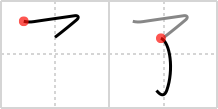

## `complete`

## [2]

## Reading:

### On-Yomi: リョウ

## Words:

修了(しゅうりょう): completion (of a course)

了(りょう): finish, completion, understanding

了解(りょうかい): comprehension, consent, understanding, roger (on the radio)

了承(りょうしょう): acknowledgement, understanding (e.g. "please be understanding of the mess during our renovation")

完了(かんりょう): completion, conclusion

終了(しゅうりょう): end, close, termination

## Koohii stories:

1) [<a href="http://kanji.koohii.com/profile/sutebun">sutebun</a>] 8-9-2007(252): The experiment was a<strong> complete</strong> failure! The child was made without any arms! 

2) [<a href="http://kanji.koohii.com/profile/Christine_Tham">Christine_Tham</a>] 23-7-2007(73): A child with the arms inside the blanket will be<strong> complete</strong>ly wrapped up. 

3) [<a href="http://kanji.koohii.com/profile/P2daGn3">P2daGn3</a>] 2-6-2008(56): The child in not<strong> complete</strong>. He&#039;s got no arms! 

4) [<a href="http://kanji.koohii.com/profile/Katsuo">Katsuo</a>] 23-12-2008(42): Don&#039;t be tempted to write another stroke and make   <a href="http://jisho.org/kanji/details/子">子</a>  . This kanji,   <a href="http://jisho.org/kanji/details/了">了</a>  , is already<strong> complete</strong>. 

5) [<a href="http://kanji.koohii.com/profile/burritokun">burritokun</a>] 8-8-2008(21): No parent can say their child rearing is<strong> complete</strong> until the child stops holding out his hand for money. 

6) [<a href="http://kanji.koohii.com/profile/tokyokanji">tokyokanji</a>] 6-10-2009(16): &quot;Your failure is<strong> complete</strong>&quot; says Darth Vader as he chops off his child&#039;s arms with his saber. 

7) [<a href="http://kanji.koohii.com/profile/PeterJD">PeterJD</a>] 12-4-2008(11): リョウ　COMPLETE; FINISH; UNDERSTAND. &quot;All parents <em>UNDERSTAND</em> that their day is not<strong> COMPLETE</strong> until their <em>CHILD</em> is tucked snuggly in bed (with arms under the blanket).&quot; [<em>Note</em>: This is the completion &quot;le&quot; in Chinese grammar.] E.G.:   <a href="http://jisho.org/kanji/details/終了する">終了する</a>  （しゅうりょう）to<strong> complete</strong>.   <a href="http://jisho.org/kanji/details/了解">了解</a>  （りょうかい）understanding. 

8) [<a href="http://kanji.koohii.com/profile/PepeSeco">PepeSeco</a>] 2-5-2007(9): I use these two lines from Piano Man by Billy Joel: &quot;But its sad and its sweet and I knew it<strong> complete</strong> // When I wore a younger mans clothes...&quot; In fact he was so young that he was a child, and his clothes hid his arms. 

9) [<a href="http://kanji.koohii.com/profile/shinanaide">shinanaide</a>] 15-1-2011(7): You must be a ____ jerk to make fun of a CHILD with NO ARMS. 

10) [<a href="http://kanji.koohii.com/profile/mrddrr">mrddrr</a>] 23-6-2009(7): This child is not<strong> complete</strong>... 
