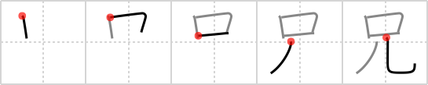

## `elder brother`

## [5]

## Reading:

### On-Yomi: ケイ、キョウ &mdash; Kun-Yomi: あに

### Examples: 兄事 (あにこと), 父兄 (ふけい), 義兄 (ぎあに), 兄 (あに)

## Words:

従兄弟(いとこ): male cousin

兄(あに): older brother

お兄さん(おにいさん): (polite) older brother, (vocative) "Mister?"

兄弟(きょうだい): siblings

## Koohii stories:

1) [<a href="http://kanji.koohii.com/profile/Christine_Tham">Christine_Tham</a>] 23-7-2007(138): My<strong> elder brother</strong> was basically a mouth on legs when he was a teenager. 

2) [<a href="http://kanji.koohii.com/profile/LeoOra">LeoOra</a>] 23-1-2008(22): The pac man&#039;s (  <a href="http://jisho.org/kanji/details/只">只</a>  )<strong> elder brother</strong> has to have longer legs than his junior. 

3) [<a href="http://kanji.koohii.com/profile/silkcherryblossoms">silkcherryblossoms</a>] 27-5-2007(15): Older teenage brothers have big mouths and long, awkward legs. 

4) [<a href="http://kanji.koohii.com/profile/taikura">taikura</a>] 7-11-2008(10): My<strong> elder brother</strong> has a big MOUTH and LONG LEGS. 

5) [<a href="http://kanji.koohii.com/profile/Teango">Teango</a>] 8-3-2010(9): My <strong>elder brother</strong> always let his <em>mouth</em> <em>run</em>. 

6) [<a href="http://kanji.koohii.com/profile/NibelungValesti">NibelungValesti</a>] 16-4-2010(4): My<strong> elder brother</strong> IS a mouth on legs. 

7) [<a href="http://kanji.koohii.com/profile/dzurn">dzurn</a>] 18-7-2011(3): My<strong> elder brother</strong> is just a <em>Mouth</em> on <em>Legs</em>. Eat, Eat, Eat. 

8) [<a href="http://kanji.koohii.com/profile/Reynaldo">Reynaldo</a>] 1-2-2006(3): Freedom to speak. Freedom to go out. 

9) [<a href="http://kanji.koohii.com/profile/Dright">Dright</a>] 24-8-2012(2): The <em>only</em> child grew up and became an<strong> elder brother</strong>. 

10) [<a href="http://kanji.koohii.com/profile/rezefty">rezefty</a>] 11-7-2012(2): My<strong> elder brother</strong> is a teenager with a big moth and long legs. 
