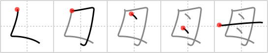

## `mama`

## [5]

## Reading:

### On-Yomi: ボ &mdash; Kun-Yomi: はは、も

## Heisig story:

Look closely at this kanji and you will find the outline of the kanji for <i>woman</i> in it, the second stroke of which has been expanded to make space for the two breasts that make her a <b>mama</b>. Likening this sound to a baby nursing at its mother's breast has afforded some scholars of comparative linguistics a way to explain the presence of the same word across a wide range of language groups.

## Premitive:

As a primitive we shall add the meaning of BREATS in accord with the explanation given above. Take careful note of the fact that the form is altered slightly when this kanji serves as a primitive, the final two dots joining together to form a longer stroke. An example follows in the next FRAME. SIMPLE  The two breasts of a momma who breastfeeds.

## Koohii stories:

1) [<a href="http://kanji.koohii.com/profile/mr_hans_moleman">mr_hans_moleman</a>] 5-7-2007(76): The two breasts of a momma who breastfeeds.

2) [<a href="http://kanji.koohii.com/profile/gaijinda">gaijinda</a>] 14-10-2007(34): This<strong> mama</strong> had twins, one <em>mouth</em> for each <em>nipple</em>.

3) [<a href="http://kanji.koohii.com/profile/kat1420">kat1420</a>] 11-3-2008(16): To remember strokes: it&#039;s a <em>breast</em> exam: 1)start like a <em>woman</em> 2) cross your heart (the lower right is crossed) 3) check your &quot;nipples&quot; 4) lift and separate (the last stroke parts the two &quot;breasts&quot;).

4) [<a href="http://kanji.koohii.com/profile/DavidZ">DavidZ</a>] 11-2-2010(13): <em>L7</em>... To remember the strokes: this begins by writing &quot;L7&quot;, which is 50s slang for &quot;square&quot; or uncool. (As a teenager I thought my<strong> mama</strong> was really square) Add the &quot;nipples&quot; and then use the last stroke to part the two &quot;breasts&quot;... 母 [はは] <a href="http://google.com/#q=、お母さん">、お母さん</a> [おかあさん] <a href="http://google.com/#q=、母乳">、母乳</a> [ぼにゅう] <a href="http://google.com/#q=、伯母">、伯母</a> /叔母[おば].

5) [<a href="http://kanji.koohii.com/profile/Christine_Tham">Christine_Tham</a>] 23-7-2007(13): The<strong> mama</strong> has two babies (drops) in the cradle.

6) [<a href="http://kanji.koohii.com/profile/nesert">nesert</a>] 28-9-2009(11): When a <em>woman</em> becomes a<strong> mama</strong> her <em>breasts</em> grow and fill with <em>drops</em> of milk.

7) [<a href="http://kanji.koohii.com/profile/j0k0m0">j0k0m0</a>] 21-8-2011(5): <strong>Mama</strong> mia- nice rack! dot dot.... 母 はは (n) (hum) mother....(Reporters! Oh c&#039;mon!! &quot;Nice rack&quot; is a compliment! It&#039;s kind of like &quot; You smell good&quot;.) 叔母 【おば】aunt (younger than one&#039;s parent) ・ 伯母 【おば】aunt (older than one&#039;s parent).

8) [<a href="http://kanji.koohii.com/profile/cubasterd">cubasterd</a>] 11-9-2007(4): The sun has two drops called ma &amp; ma.

9) [<a href="http://kanji.koohii.com/profile/Falafel">Falafel</a>] 15-11-2011(3): <strong>MAMA</strong>&#039;s code name is <strong>L7 dot dot dash</strong>.

10) [<a href="http://kanji.koohii.com/profile/undomiel">undomiel</a>] 5-4-2011(3): <strong>Mama</strong> knows breast,<strong> mama</strong> knows breast.
