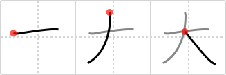

## `large`

## [3]

## Reading:

### On-Yomi: ダイ、タイ &mdash; Kun-Yomi: おお-、おお.きい、-おお.いに

## Heisig V6:

Here we have a simple pictograph of a person, taking up the space of an entire character and giving it the sense of <b>large</b>. It should not be too hard to locate the two legs and outstretched arms.

## Koohii stories:

1) [<a href="http://kanji.koohii.com/profile/pageturner1988">pageturner1988</a>] 13-9-2007(79): A person stretching their arms and legs to look<strong> large</strong> and scare a bear away.

2) [<a href="http://kanji.koohii.com/profile/Teango">Teango</a>] 8-3-2010(23): How<strong> large</strong>? This<strong> large</strong>!

3) [<a href="http://kanji.koohii.com/profile/Christine_Tham">Christine_Tham</a>] 23-7-2007(21): Think of a<strong> large</strong> St. Bernard dog with his paws all stretched out.

4) [<a href="http://kanji.koohii.com/profile/LeoOra">LeoOra</a>] 27-1-2008(13): A person ( 人 -fr.951) showing itself<strong> large</strong>r widening its arms.

5) [<a href="http://kanji.koohii.com/profile/xiteru">xiteru</a>] 9-10-2007(6): That volcano is so big, or<strong> large</strong>, it goes over the clouds (the clouds being the horizontal line).

6) [<a href="http://kanji.koohii.com/profile/Lindley">Lindley</a>] 24-3-2009(4): A <em>person</em> stretching his arms to hold a <strong>large</strong> <em>St. Bernard dog</em> after its bath.

7) [<a href="http://kanji.koohii.com/profile/kanpai">kanpai</a>] 27-1-2011(3): It was &#039;this<strong> large</strong>&#039;.

8) [<a href="http://kanji.koohii.com/profile/faeya">faeya</a>] 9-1-2011(3): A<strong> large</strong> guy holding his arms out to hug his <em>St. Bernard</em>.

9) [<a href="http://kanji.koohii.com/profile/gyouza">gyouza</a>] 16-6-2010(2): Pictograph of a person spreading his arms to show how <strong>large</strong> the fish he caught was.

10) [<a href="http://kanji.koohii.com/profile/aquanoodle">aquanoodle</a>] 25-3-2008(2): A <em>person</em> ( 人 -fr.951)　with stretched out <em>arms</em> to look<strong> large</strong>.
