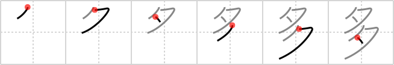

## `many`

## [6]

## Reading:

### On-Yomi: タ &mdash; Kun-Yomi: おお.い、まさ.に、まさ.る

## Koohii stories:

1) [<a href="http://kanji.koohii.com/profile/stereovibe">stereovibe</a>] 13-2-2008(105): <em>Two evenings</em> too<strong> many</strong>! 

2) [<a href="http://kanji.koohii.com/profile/scottamus">scottamus</a>] 17-3-2006(46): This reminds me of a childish pseudo-confucion rhyme: &quot;He who eats<strong> many</strong> prunes sits on toilet<strong> many</strong> <em>moons</em>&quot;. 

3) [<a href="http://kanji.koohii.com/profile/crystalcastlecreature">crystalcastlecreature</a>] 3-6-2008(40): These look like the katakana &quot;ta&quot; therefore; There are<strong> MANY</strong> tatas! WOO~~~! 

4) [<a href="http://kanji.koohii.com/profile/pageturner1988">pageturner1988</a>] 18-12-2007(16): The ninja waited<strong> many</strong> evenings for the right moment to strike. 

5) [<a href="http://kanji.koohii.com/profile/FauxSho">FauxSho</a>] 9-2-2013(13): <strong>Many</strong> <em>moons</em> ago.. or perhaps it was just a couple of <em>evenings</em>, I can&#039;t remember. 

6) [<a href="http://kanji.koohii.com/profile/Srdjan">Srdjan</a>] 1-11-2008(12): In England,<strong> many</strong> people say ta-ta instead of good bye. 

7) [<a href="http://kanji.koohii.com/profile/LeoOra">LeoOra</a>] 4-2-2008(11): If we repeat some action<strong> many</strong> <em>evenings</em> (  <a href="http://jisho.org/kanji/details/夕">夕</a>  ) we&#039;ll get the sense of <strong>frequency</strong> (another meaning of this kanji). 

8) [<a href="http://kanji.koohii.com/profile/atomiton">atomiton</a>] 25-9-2006(11): Two moons is too<strong> many</strong>. 

9) [<a href="http://kanji.koohii.com/profile/Christine_Tham">Christine_Tham</a>] 4-8-2007(9): Two MOONs, or two EVENINGs? In either case, it&#039;s &quot;two&quot;<strong> many</strong>. 

10) [<a href="http://kanji.koohii.com/profile/thegeezer3">thegeezer3</a>] 3-9-2006(7): A drunken man collapsed on the ground looks up in the sky to see two moons and thats when he knows that hes had too<strong> many</strong> to drink. The moons are overlapping and slightly concealed by a cloud hence the lack of one stroke in each. 
