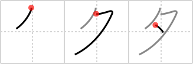

# {夕}

## Strokes: 3

## Reading:

### On-Yomi: セキ &mdash; Kun-Yomi: ゆう

### Examples: 夕 (ゆう)

## Words:

夕暮れ(ゆうぐれ): evening, (evening) twilight

夕焼け(ゆうやけ): sunset

夕刊(ゆうかん): evening paper

夕立(ゆうだち): (sudden) evening shower (rain)

夕日(ゆうひ): setting sun

夕べ(ゆうべ): evening, last night

夕飯(ゆうはん): dinner

夕方(ゆうがた): evening
