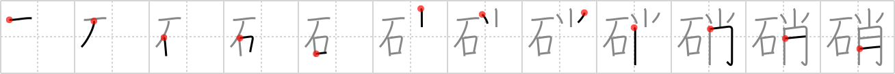

## `nitrate`

## [12]

## Reading:

### On-Yomi: ショウ

## Koohii stories:

1) [<a href="http://kanji.koohii.com/profile/mameha1977">mameha1977</a>] 10-7-2007(174): That stone has sparks coming out of it! Someone must have poured<strong> nitrate</strong> acid on it. 

2) [<a href="http://kanji.koohii.com/profile/Xtophe">Xtophe</a>] 18-9-2006(74): Salpetre is the common name for<strong> Nitrate</strong> coming from Latin &quot;sal petrae&quot; or <em>stone</em> salt. It is also a component of gun powder so including a <em>candle</em> in this kanji can be quite explosive! 

3) [<a href="http://kanji.koohii.com/profile/nurupo">nurupo</a>] 24-4-2008(41): People I study Kanji with kept talking about some<strong> nitrate</strong>. I didn&#039;t even know what<strong> nitrate</strong> is, so I hit them with a stone so hard there were sparks flying everywhere. Months later my cell-mate in jail told me it&#039;s some sort of acid, but I didn&#039;t care any more... Thanks to this Kanji I got 30 years, thank you. 

4) [<a href="http://kanji.koohii.com/profile/Dualta">Dualta</a>] 25-2-2008(18): That stone resembles<strong> nitrate</strong>. 

5) [<a href="http://kanji.koohii.com/profile/bakamono">bakamono</a>] 30-9-2007(16): A stone containing<strong> nitrate</strong> and a candle are not good together. 

6) [<a href="http://kanji.koohii.com/profile/KoiNoDensetsu">KoiNoDensetsu</a>] 3-8-2009(14): <strong>Nitrate</strong> was poured onto the rock. Sparks flew everywhere. 

7) [<a href="http://kanji.koohii.com/profile/glacier">glacier</a>] 3-4-2009(9): <strong>nitrate</strong> = <strong>gunpowder</strong>=<strong>niter</strong>. Niter is an incrustation of rock, so (as Yoda would say), &quot;<strong>Nitrate</strong>, a <em>rock</em> does it <em>resemble</em> ショー. 

8) [<a href="http://kanji.koohii.com/profile/uchifly">uchifly</a>] 5-11-2009(6): <strong>NITRATE</strong> is a STONE that sparks like a CANDLE. 

9) [<a href="http://kanji.koohii.com/profile/hazyjazy">hazyjazy</a>] 9-3-2010(5): <strong>Nitrate</strong> has a stone resemblance. 

10) [<a href="http://kanji.koohii.com/profile/zdnks">zdnks</a>] 31-10-2007(5): <strong>Nitrate</strong> is a thing that can turn a stone into a candle. 
