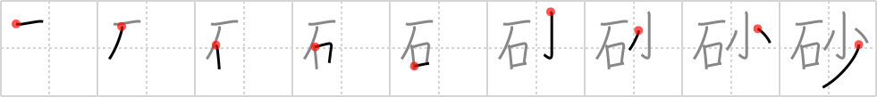

## `sand`

## [9]

## Reading:

### On-Yomi: サ、シャ &mdash; Kun-Yomi: すな

## Heisig story:

Good <b>sand</b> for beaches has <i>few</i> or no <i>stones</i> in it. That means that all of us whose feet have been spoiled by too much time in shoes don't have to watch our step as we cavort about.

## Koohii stories:

1) [<a href="http://kanji.koohii.com/profile/mspertus">mspertus</a>] 31-5-2006(143): Here&#039;s how I remember that <em>stone</em> is on the left. This is because<strong> sand</strong> starts as <em>stones</em>, and only later they become <em>few</em>.

2) [<a href="http://kanji.koohii.com/profile/TerryS">TerryS</a>] 26-11-2008(112): In good<strong> SAND</strong>, <em>stones</em> are <em>few</em>, if any.

3) [<a href="http://kanji.koohii.com/profile/nagisa">nagisa</a>] 5-3-2007(28): Over time, <em>rocks</em> are worn down into just a <em>few</em> grains of<strong> sand</strong>.

4) [<a href="http://kanji.koohii.com/profile/Christine_Tham">Christine_Tham</a>] 24-7-2007(27): To make<strong> sand</strong>, start by grinding a few stones.

5) [<a href="http://kanji.koohii.com/profile/dshill99">dshill99</a>] 4-6-2009(11): <strong>Sand</strong> has <em>stones</em> <em>few</em> and far between. 砂 【すな】 (n)<strong> sand</strong>; grit; 砂糖 【さとう】 (n) sugar;.

6) [<a href="http://kanji.koohii.com/profile/allanh">allanh</a>] 25-6-2008(11): <strong>Sand</strong> is a made of quite a <em>few</em> tiny <em>stones</em>.

7) [<a href="http://kanji.koohii.com/profile/Keiran_Halcyon">Keiran_Halcyon</a>] 8-7-2009(7): <strong>Sand</strong> started as <em>rocks</em>, but now there are only a <em>few</em>.

8) [<a href="http://kanji.koohii.com/profile/Raichu">Raichu</a>] 13-10-2011(4): <strong>Sand</strong> has only a <em>few stones</em> in it.

9) [<a href="http://kanji.koohii.com/profile/Imparatus">Imparatus</a>] 6-5-2010(4): When the<strong> sand</strong> is new, the <em>stones</em> are <em>few</em>.

10) [<a href="http://kanji.koohii.com/profile/torokun">torokun</a>] 22-11-2009(3): The best beach<strong> sand</strong> is that with very <em>few</em> <em>rocks</em> in it.
