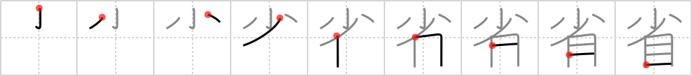

# {省}

## Strokes: 9

## Reading:

### On-Yomi: セイ、ショウ &mdash; Kun-Yomi: かえり.みる、はぶ.く

### Examples: 反省 (はんせい), 内省 (ないせい), 帰省 (きせい), 省みる (かえり.みる), 省く (はぶ.く)

## Words:

省みる(かえりみる): to reflect

省略(しょうりゃく): omission, abbreviation, abridgment

省く(はぶく): omit, eliminate, curtail, economize

反省(はんせい): reflection, reconsideration, introspection, meditation, contemplation
