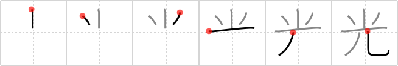

## `ray`

## [6]

## Reading:

### On-Yomi: コウ &mdash; Kun-Yomi: ひか.る、ひかり

## Heisig story:

There are really only 2 primitives here, <i>little</i> and <i>human legs</i>. The 4th stroke that separates them is added for reasons of aesthetics. (If that doesn't make sense, try writing the kanji without it and see how ugly the results look, even to your beginner's eye.) Now if you have wondered what those little particles of &quot;dust&quot; are that dance around in the light-<b>rays</b> that come through the window and fall on your desk, try imagining them as <i>little</i> and disembodied <i>human legs</i>, and you should have no trouble with this character.

## Koohii stories:

1) [<a href="http://kanji.koohii.com/profile/guidedog">guidedog</a>] 9-2-2007(132): A<strong> ray</strong> of light is not a wave but made of <em>little</em> photons with <em>human legs</em>.

2) [<a href="http://kanji.koohii.com/profile/sethimayne">sethimayne</a>] 27-9-2007(86): The<strong> ray</strong> from Honey I Shrunk the Kids made people <em>little</em> - ha! look at them run around on their tiny <em>legs</em>!

3) [<a href="http://kanji.koohii.com/profile/cloudstrife543">cloudstrife543</a>] 1-11-2008(47): Imagine a<strong> ray</strong> gun shooting someone and their body exploding (sparks) and just their legs left.

4) [<a href="http://kanji.koohii.com/profile/Dualta">Dualta</a>] 25-2-2008(30): <strong>Little legs</strong> at play are a<strong> ray</strong> of light in my day.

5) [<a href="http://kanji.koohii.com/profile/oRis1024">oRis1024</a>] 20-7-2008(24): <strong>Ray</strong> is <em>tiny</em> <em>legs</em> of light...

6) [<a href="http://kanji.koohii.com/profile/applesuki">applesuki</a>] 4-9-2006(14): A<strong> ray</strong> of light may run of little legs, but it is the fastest thing in the universe!

7) [<a href="http://kanji.koohii.com/profile/crd88">crd88</a>] 19-4-2010(7): In the <em>beginning</em> there was a <em>little</em><strong> ray</strong> of light.

8) [<a href="http://kanji.koohii.com/profile/mudbum">mudbum</a>] 5-6-2008(7): <strong>Ray</strong> Charles has little legs, funny haha.

9) [<a href="http://kanji.koohii.com/profile/DavidZ">DavidZ</a>] 24-1-2010(5): Marvin the Martian says, &quot;Halt or I will shoot you with my<strong> ray</strong> gun.&quot; Beside the big helmet, he is just a <em>little</em> pair of <em>human legs</em>... 光る [ひかる] <a href="midori://search?text=、日光">、日光</a> [にっこう] <a href="midori://search?text=、観光客">、観光客</a> [かんこうきゃく] tourist.

10) [<a href="http://kanji.koohii.com/profile/TheBrain">TheBrain</a>] 23-12-2008(5): <strong>Ray</strong> may be <em>little</em>, but he does have <em>human legs</em>.
