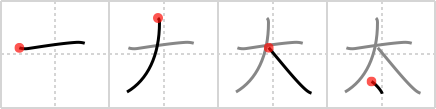

## `plump`

## [4]

## Reading:

### On-Yomi: タイ、タ &mdash; Kun-Yomi: ふと.い、ふと.る

## Heisig story:

&quot;<b>Plump</b>&quot; is one of those delightful English words that almost sound like their meaning. No sooner do you hear it than you think of a round and ample-bodied person falling into a sofa like a <i>large drop</i> of oil plopping into a fishbowl - kerrrr-<b>plump</b>!

## Koohii stories:

1) [<a href="http://kanji.koohii.com/profile/lilpea">lilpea</a>] 3-8-2007(152): A <em>large</em> person with a big <em>drop</em> of sweat dripping off of him because he is so<strong> plump</strong>.

2) [<a href="http://kanji.koohii.com/profile/chamcham">chamcham</a>] 27-2-2006(80): Fat(&quot;plump&quot;) men always have small penises.....the kanji is a combination of &quot;large&quot; with a drop(representing the small penis between his legs).

3) [<a href="http://kanji.koohii.com/profile/Danieru">Danieru</a>] 28-1-2008(36): A big,<strong> plump</strong> sumo wrestler with a loincloth covering his little drop. (Thanks Fabrice).

4) [<a href="http://kanji.koohii.com/profile/fuaburisu">fuaburisu</a>] 5-2-2006(19): To keep this distinct from the primitive meaning of &quot;round&quot; (&quot;fat man&quot;) I suggest to use a specific image, such as that of a<strong> plump</strong> Japanese sumo wrestler, and let the <em>drop</em> between the legs be the loincloth (which compared to their <em>large</em> body size, is quite a <em>drop</em>). To illustrate the importance of this, have a look at the kanji for &quot;tenacious&quot; (frame 1506) and &quot;burdensome&quot; (frame 1986).

5) [<a href="http://kanji.koohii.com/profile/ctalbottclark">ctalbottclark</a>] 8-3-2008(15): The<strong> plump</strong> <em>dog</em> <em>drop</em>ped its tail between its legs.

6) [<a href="http://kanji.koohii.com/profile/liosama">liosama</a>] 26-6-2008(13): A LARGE man takes a dump, and when the poo falls int he toilet it makes a<strong> plump</strong> sound.

7) [<a href="http://kanji.koohii.com/profile/taikura">taikura</a>] 8-11-2008(8): <strong>PLUMP</strong> people are LARGE and SWEAT a lot.

8) [<a href="http://kanji.koohii.com/profile/akane99">akane99</a>] 8-7-2010(7): A<strong> PLUMP</strong> man with a little penis.

9) [<a href="http://kanji.koohii.com/profile/krungthep">krungthep</a>] 26-3-2008(7): A<strong> plump</strong> person is one whose body has the shape of a <em>large</em> <em>drop</em>.

10) [<a href="http://kanji.koohii.com/profile/fabiomandrioli">fabiomandrioli</a>] 4-1-2009(5): A<strong> plump</strong> <em>St. Bernard dog</em> on the snow and his <em>large drop</em> of &quot;brownie&quot; clearly visible.

### {V4: 120, V6: 126}
