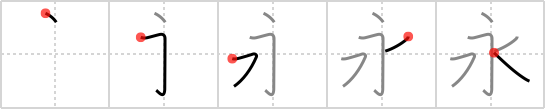

## `eternity`

## [5]

## Reading:

### On-Yomi: エイ &mdash; Kun-Yomi: なが.い

## Heisig V6:

This kanji also uses the full form of <i>water</i>, though its meaning seems to have nothing at all to do with <i>water</i>. Remember what William Blake said about seeing &quot;infinity in a grain of sand and <b>eternity</b> in an hour&quot;? Well, reading this character from top to bottom, we see &quot;<b>eternity</b> in a <i>drop of water</i>.&quot;

## Koohii stories:

1) [<a href="http://kanji.koohii.com/profile/ruisu">ruisu</a>] 7-9-2007(177): It would take an<strong> eternity</strong> to count all the drops of water.

2) [<a href="http://kanji.koohii.com/profile/lilpea">lilpea</a>] 3-8-2007(50): It takes but one <em>drop</em> from the most special <em>water</em>: the fountain of youth (and it is written in a special way to with an extra horizontal line on the top) to live for an<strong> eternity</strong>. (In order to remember that the drop is at the top, think that the drop must come from the topmost water in order for its effects to be true).

3) [<a href="http://kanji.koohii.com/profile/lucianreign">lucianreign</a>] 22-11-2006(36): What is your life? A DROP of water on a mini FLOOR when compared to<strong> ETERNITY</strong>!

4) [<a href="http://kanji.koohii.com/profile/Ameyama">Ameyama</a>] 22-2-2008(28): It will take<strong> ETERNITY</strong> for that drop of water above to drip. Especially since theres a ledge below it...

5) [<a href="http://kanji.koohii.com/profile/tharvey">tharvey</a>] 25-1-2009(16): The <em>drop</em> hung on the ledge above the <em>water</em> for an<strong> eternity</strong>.

6) [<a href="http://kanji.koohii.com/profile/epmason">epmason</a>] 8-7-2009(9): When it comes to Chinese water torture, the drops of water on your head seem to last an<strong> eternity</strong>. Drop, drop, drop...

7) [<a href="http://kanji.koohii.com/profile/gandiva">gandiva</a>] 28-5-2009(8): It only takes a <em>drop of water</em> from the fountain of youth to live for<strong> eternity</strong>.

8) [<a href="http://kanji.koohii.com/profile/Lazerbeat">Lazerbeat</a>] 22-6-2011(5): Chinese water torture : drops of water from above last an<strong> eternity</strong>.

9) [<a href="http://kanji.koohii.com/profile/calderra">calderra</a>] 15-9-2009(5): Care should be taken to distinguish this kanji from &quot;icicle&quot; (#131 氷). The only difference is that little ledge pushing the drop into a higher position. Right now I use a combined story- it takes an<strong> ETERNITY</strong> for that little DROP of WATER to fall down the ledge and make an ICICLE.

10) [<a href="http://kanji.koohii.com/profile/DBJ07">DBJ07</a>] 17-2-2007(5): <strong>Eternity</strong> is equal to water plus a drop.
