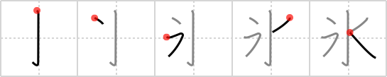

## `icicle`

## [5]

## Reading:

### On-Yomi: ヒョウ &mdash; Kun-Yomi: こおり、ひ、こお.る

## Heisig story:

The appearance of the primitive for <i>water</i> in its full form tells us that we have something to do with <i>water</i> here. The extra <i>drop</i> to the left, added as a second stroke, changes the picture from a splash caused by a <i>walking stick</i> dropped into <i>water</i> to form an <b>icicle</b>. If it helps, when you hold an <b>icicle</b> up to the light, you can usually see little crystallizations of five-pointed stars inside of it, which is the shape we have in this kanji.

## Koohii stories:

1) [<a href="http://kanji.koohii.com/profile/brian44">brian44</a>] 28-8-2007(238): <strong>Icicle</strong>s start with 1 frozen <em>drop</em> of <em>water</em>.

2) [<a href="http://kanji.koohii.com/profile/stereovibe">stereovibe</a>] 27-2-2008(73): <em>A drop</em> in temperature turns <em>water</em> into an<strong> icicle</strong>.

3) [<a href="http://kanji.koohii.com/profile/Ameyama">Ameyama</a>] 22-2-2008(15): Ooooh (う） Look at the drops of water from that<strong> icicle</strong>. (Hiragana う looks like the left side).

4) [<a href="http://kanji.koohii.com/profile/haole">haole</a>] 27-10-2009(8): Just as you dot the &quot;i&quot; in<strong> icicle</strong>, so should you dot the water!

5) [<a href="http://kanji.koohii.com/profile/undead_saif">undead_saif</a>] 29-1-2009(7): <strong>Icicle</strong>s form when water drops drop down on each other and freeze. look <a href="http://en.wikipedia.org/wiki/Icicle">http://en.wikipedia.org/wiki/Icicle</a>.

6) [<a href="http://kanji.koohii.com/profile/Christine_Tham">Christine_Tham</a>] 30-7-2007(6): An<strong> icicle</strong> can form just by freezing one DROP of WATER.

7) [<a href="http://kanji.koohii.com/profile/robinowen">robinowen</a>] 14-6-2010(5): An<strong> icicle</strong> is like <em>water</em> except for the <em>drop</em> in temperature.

8) [<a href="http://kanji.koohii.com/profile/Ramchip">Ramchip</a>] 9-8-2007(4): This character and <a href="../v4/132">eternity</a> (#132 永) are somewhat confusing. If you can remember how they&#039;re written but often take one for the other, imagine that eternity is above water and all the other elements, while<strong> icicle</strong>s are to the side of a half-frozen waterfall.

9) [<a href="http://kanji.koohii.com/profile/FinPat">FinPat</a>] 4-2-2013(3): An<strong> icicle</strong> forms from a drop of water on the left.

10) [<a href="http://kanji.koohii.com/profile/alphador">alphador</a>] 31-1-2010(3): Una GOCCIA di ACQUA che cola giù, con il freddo intenso si trasformerà presto in un GHIACCIOLO.

### {V4: 131, V6: 138}
