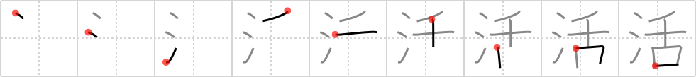

# {活}

## `lively`

## Strokes: 9

## Reading:

### On-Yomi: カツ &mdash; Kun-Yomi: い.きる、い.かす、い.ける

## Words:

活ける(いける): to arrange (flowers)

活発(かっぱつ): vigor, active

生活(せいかつ): living, life (one´s daily existence), livelihood

復活(ふっかつ): revival (e.g. musical), restoration

活気(かっき): energy, liveliness

活字(かつじ): printing type

活動(かつどう): action, activity

活躍(かつやく): activity

活用(かつよう): conjugation, practical use

活力(かつりょく): vitality, energy
