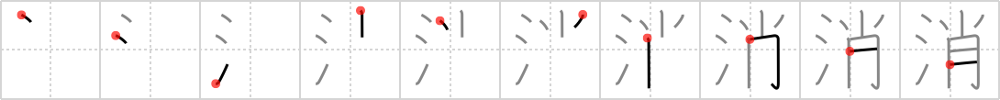

# {144}

## `extinguish`

## [10]

## Reading:

### On-Yomi: ショウ &mdash; Kun-Yomi: き.える、け.す

### Examples: 消える (き.える), 消す (け.す)

## Words:

打ち消し(うちけし): negation, denial, negative

消去(しょうきょ): elimination, erasing, dying out, melting away

消耗(しょうこう): exhaustion, consumption

消息(しょうそく): news, letter, circumstances

打ち消す(うちけす): deny, negate, contradict

消しゴム(けしゴム): eraser, India rubber

消化(しょうか): digestion

消極的(しょうきょくてき): passive

消毒(しょうどく): disinfection, sterilization

消費(しょうひ): consumption, expenditure

消防(しょうぼう): fire fighting, fire department

消防署(しょうぼうしょ): fire station

消耗(しょうもう): exhaustion, consumption

取り消す(とりけす): cancel

消える(きえる): go out, vanish, disappear

消す(けす): erase, delete, turn off power
