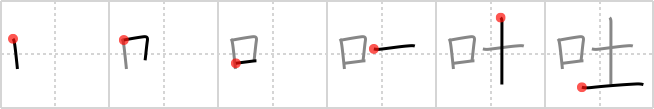

## `spit`

## [6]

## Reading:

### On-Yomi: ト &mdash; Kun-Yomi: は.く、つ.く

### Examples: 吐く (は.く)

## Words:

吐く(つく): to breathe, to tell (lies), to vomit, to disgorge

吐き気(はきけ): nausea, sickness in the stomach

吐く(はく): breathe, tell (lies), vomit

## Koohii stories:

1) [<a href="http://kanji.koohii.com/profile/zoletype">zoletype</a>] 8-4-2008(123): <strong>SPIT</strong> goes from my MOUTH to the GROUND. 

2) [<a href="http://kanji.koohii.com/profile/mameha1977">mameha1977</a>] 30-7-2007(69): The only things that come out of my MOUTH and onto the GROUND are<strong> spit</strong> and vomit. Everything else (words, song) floats on the air. 

3) [<a href="http://kanji.koohii.com/profile/twincy">twincy</a>] 20-6-2007(27): Means <em>vomit</em> as well. a more decent way to say what you thow up could be &quot;<em>mouth</em> <em>soil</em>&quot;. 

4) [<a href="http://kanji.koohii.com/profile/Josh_Teperman">Josh_Teperman</a>] 9-1-2009(23): When you get <em>dirt</em> in your <em>mouth</em>, you have to <strong>spit</strong> it out. 

5) [<a href="http://kanji.koohii.com/profile/smujohnson">smujohnson</a>] 27-8-2008(10): Usually when people<strong> SPIT</strong>, it&#039;s because something is LEFT IN THEIR MOUTH ... In that case, they just<strong> spit</strong> it out.. RIGHT on the GROUND! 

6) [<a href="http://kanji.koohii.com/profile/danco3636">danco3636</a>] 14-5-2009(9): Picture the<strong> spit</strong> coming out of your mouth onto the soil! 

7) [<a href="http://kanji.koohii.com/profile/dinmamma">dinmamma</a>] 6-8-2009(6): If you had DIRT in your MOUTH, you&#039;d<strong> spit</strong> it out fast and far. Note that MOUTH is on the left, in the strong position, because the word &quot;spit&quot; has more to do with the mouth than with dirt. 

8) [<a href="http://kanji.koohii.com/profile/aloha+ninetythree">aloha+ninetythree</a>] 4-7-2011(4): Whatever you choose to<strong> spit</strong> out, it goes from <em>mouth</em> to <em>soil</em>. Not the other way! kun: つ.く、 は.く on: ト. 

9) [<a href="http://kanji.koohii.com/profile/foros">foros</a>] 7-3-2010(4): If your <em>mouth</em> has <em>dirt</em> in it,<strong> spit</strong> it out! 

10) [<a href="http://kanji.koohii.com/profile/tritonxg">tritonxg</a>] 8-1-2010(4): [FR]<strong>cracher</strong> avouer japlt:N1 <strong>TO ha(ku)</strong> kanji&amp;kana:1253 <em>bouche+terre</em> si on a la BOUCHE remplie de TERRE on va <strong>CRACHER</strong> le morceau   <a href="http://jisho.org/kanji/details/吐き気">吐き気</a>  【はきけ】nausea; sickness in the stomach  <a href="http://jisho.org/kanji/details/吐き出す">吐き出す</a>  【はきだす】to vomit; to<strong> spit</strong> out  <a href="http://jisho.org/kanji/details/意見を吐く">意見を吐く</a>  【いけんをはく to give one&#039;s opinion  <a href="http://jisho.org/kanji/details/反吐">反吐</a>  【へど】spew; vomiting  <a href="http://jisho.org/kanji/details/吐息">吐息</a>  【といき】sigh; long breat  <a href="http://jisho.org/kanji/details/吐露">吐露</a>  【とろ】express one&#039;s mind; speak out. 
