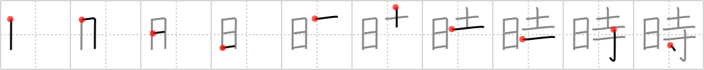

## `time`

## [10]

## Reading:

### On-Yomi: ジ &mdash; Kun-Yomi: とき、-どき

### Examples: 時 (とき)

## Words:

何時(いつ): when, how soon

何時か(いつか): sometime, some day

何時でも(いつでも): (at) any time, always, at all times, never (neg), whenever

何時の間にか(いつのまにか): before one knows, unnoticed, unawares

何時も(いつも): always, usually, every time, never (with neg. verb)

時刻表(じこくひょう): table, diagram, chart, timetable, schedule

時差(じさ): time difference

時折(ときおり): sometimes

一時(いちじ): one hour, short time, once, temporarily, at one time

時間割(じかんわり): timetable, schedule

時期(じき): time, season, period

時刻(じこく): instant, time, moment

時速(じそく): speed (per hour)

当時(とうじ): at that time, in those days

同時(どうじ): simultaneous(ly), concurrent, same time, synchronous

時(とき): time, hour, occasion, moment

日時(にちじ): date and time

臨時(りんじ): temporary, special, extraordinary

時代(じだい): age, period, generation

時間(じかん): time

時々(ときどき): sometimes

時計(とけい): watch, clock

## Koohii stories:

1) [<a href="http://kanji.koohii.com/profile/zdnks">zdnks</a>] 31-10-2007(120): When the SUN starts to shine on the TEMPLE, it&#039;s<strong> time</strong> to get up. 

2) [<a href="http://kanji.koohii.com/profile/Francois">Francois</a>] 27-2-2008(102): In ancient Japan,<strong> TIME</strong> of &#039;&#039;day&#039;&#039; was announced at the &#039;&#039;buddhist temples&#039;&#039;. They did this by ringing large iron bells. This is similar to churches who ring their bells to announce the<strong> time</strong> of day. 

3) [<a href="http://kanji.koohii.com/profile/Ningen">Ningen</a>] 26-8-2008(45): A <em>day</em> at a <em>Buddhist temple</em> is<strong> TIME</strong> well spent. 

4) [<a href="http://kanji.koohii.com/profile/Tatiana">Tatiana</a>] 19-10-2006(21): You will fully understand the concept of<strong> time</strong> if you spend a <em>day</em> in a <em>Buddhist temple</em>. 

5) [<a href="http://kanji.koohii.com/profile/raye505">raye505</a>] 5-6-2009(9): <strong>Time</strong> is marked by the sun at buddhist temples. 

6) [<a href="http://kanji.koohii.com/profile/oRis1024">oRis1024</a>] 21-7-2008(6): Sun is the only way to tell<strong> time</strong> from a Buddhist temple. 

7) [<a href="http://kanji.koohii.com/profile/ninjagaijin">ninjagaijin</a>] 25-4-2011(4): The monks measure<strong> time</strong> simply by watching the <em>sun</em> [<a href="../12">day</a> (#12 <a href="http://jisho.org/kanji/details/日">日</a>)] pass over their <em>temple</em> [<a href="../158">Buddhist temple</a> (#158 <a href="http://jisho.org/kanji/details/寺">寺</a>)]. 

8) [<a href="http://kanji.koohii.com/profile/Furanshisuko">Furanshisuko</a>] 1-7-2009(4): It was as if<strong> time</strong> stopped as I watched the <em>sun</em> rise behind the <em>Buddhist temple</em>. 

9) [<a href="http://kanji.koohii.com/profile/Ninjasha">Ninjasha</a>] 11-12-2007(4): <strong>TIME</strong> is of little import in the every<em>day</em> life of a <em>Buddhist temple</em>. 

10) [<a href="http://kanji.koohii.com/profile/Lazerbeat">Lazerbeat</a>] 17-8-2011(3): A DAY at a TEMPLE is<strong> Time</strong> well spent. 
